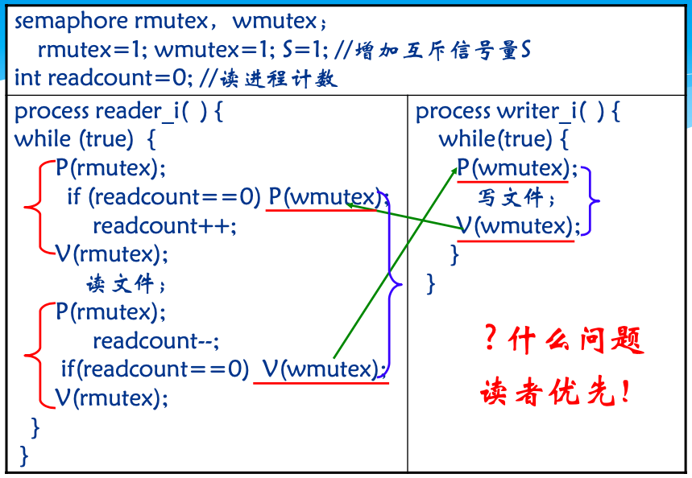
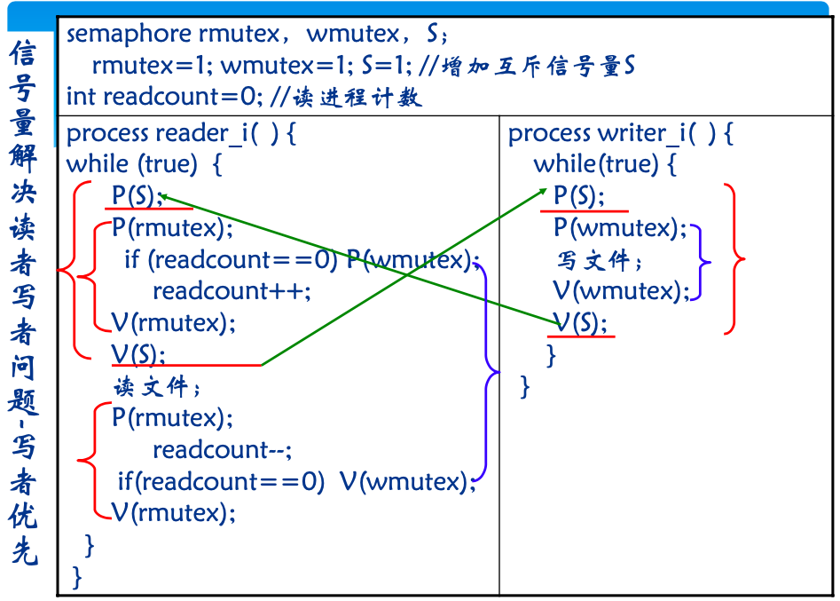
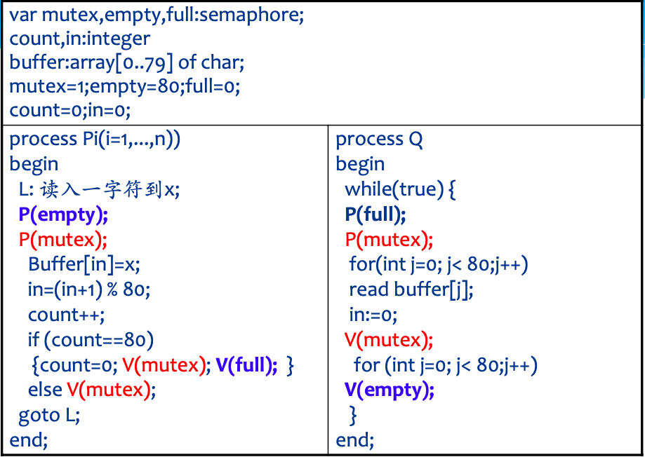
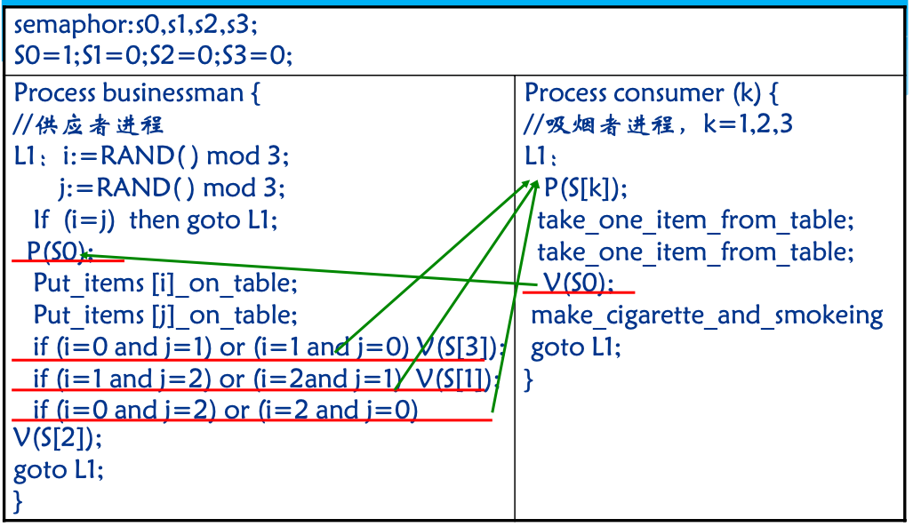
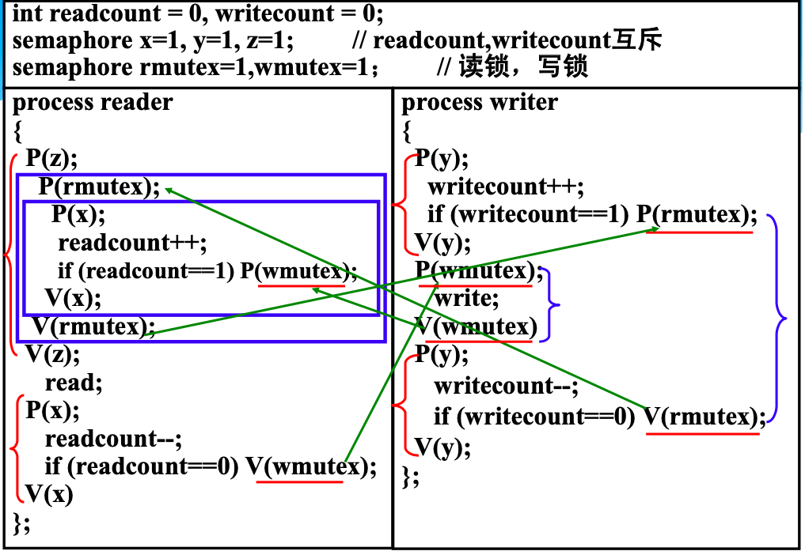
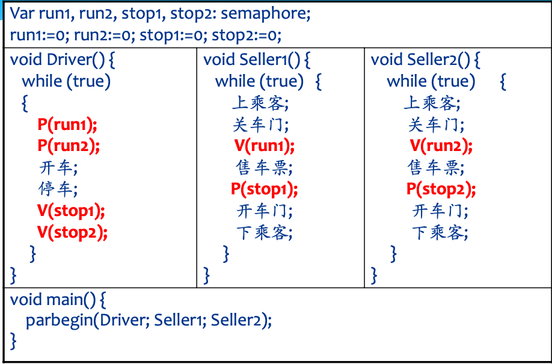
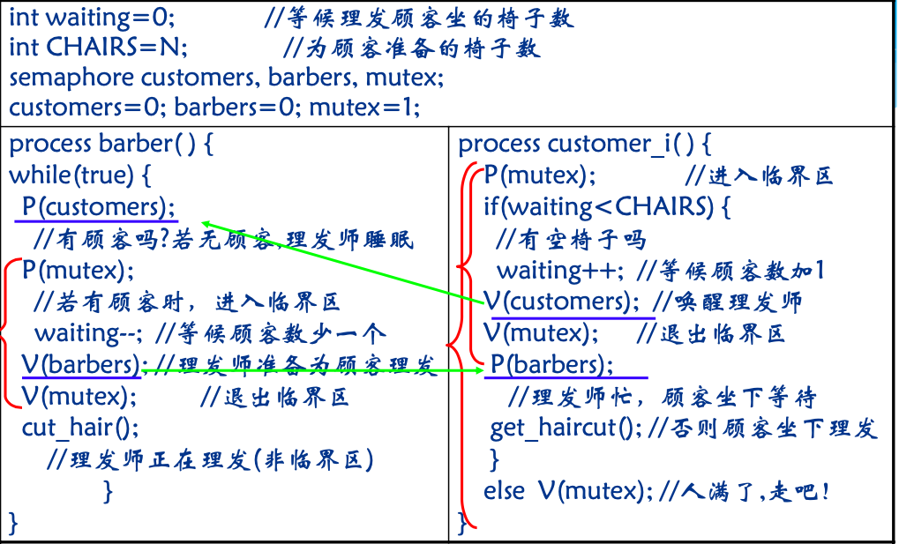
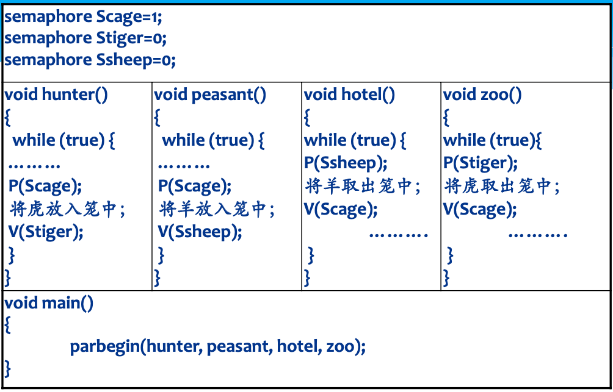
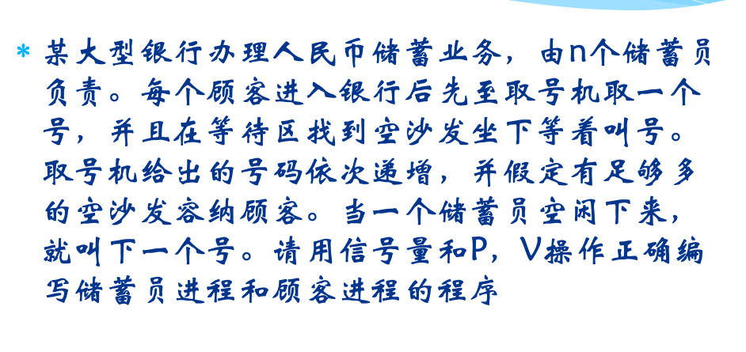
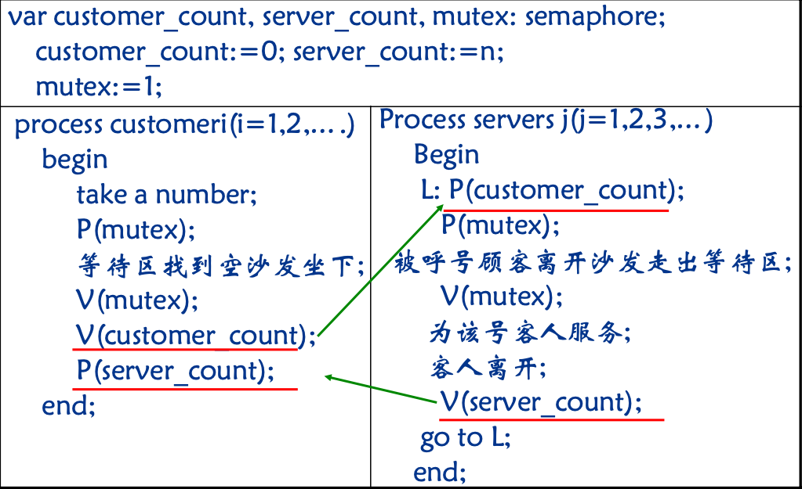

#深入理解PV操作

[TOC]

- 如果针对的是资源，那么PV的含义如下
  - P(S) : 申请资源S  ---  如果有资源S，则占有资源，并让 资源 - 1
  - V(S) : 归还资源S ---  释放资源S， 资源数 +1
- 如果针对的是进程
  - ⚠️P(S) : 如果没有其他进程S正在占有临界区，并挂起其他想进入临界区的S进程  Or 阻塞自己，期待被一个 V(S)唤醒
  - V(S) : 唤醒其他想进入临界区的S进程. 
  - ⚠️注意：信号量应表示**互斥**的过程

### 1. 针对资源型

#### 基本方法

- 对每种资源设置信号量
- 空闲位置也算资源
- 思考信号量的初值

#### 飞机票问题

#### 哲学家进餐问题

#### 生产者-消费者问题

```c++
semaphore mutex = 1;
semaphore empty = n;
semaphore full = 0;
producer(){
  	while(1){
      	P(empty);
      	P(mutex);
      	//produce;
      	V(mutex);
      	V(full);
    }
}
consumer(){
  	while(1){
        P(full);
      	P(mutex);
      	remove an item from buffer;
      	V(mutex);
        V(empty);
      	//consume the item;
    }
}
```


#### 苹果橘子问题

#### 农夫-猎人问题

有一个铁笼子，每次只能放入一个动物。 猎手向笼中放入老虎，农夫向笼中放入羊; 动物园等待取笼中的老虎，饭店等待取笼 中的羊。请用P、V操作原语写出同步执行 的程序


### 2. 针对进程型（进程协作）

#### 基本方法

1. 为每个进程创建一个信号量（思考信号量的意义:如果该进程是可以并发访问临界区，但进入临界区的过程肯定是不可并发的，所以信号量可以表示为正在**“进入”**该临界区的进程数）
2. 为可并行执行的进程设置计数器，并为计数器的修改设置信号量
3. 分析每个进程进入和出去时的前置条件&  后置条件
4. 简化（去掉可以省略的信号量）
5. ⚠️思考信号量的初值

#### 读者写者问题（写者优先）

```c
1.为写者创建信号量 writer = 1  // writer 表示正在写的写者
  为读者创建信号量 reader = 1  // reader 表示有读者正在进入临界区的读者
  //信号量的意义是 互斥地进行某项活动
  //因为读者可以并行执行，所以用reader来表示正在读的读者是没有意义的
  //而读者进入临界区的过程却是互斥的，因此用reader来表示正在进入临界区的读者
2. 读者可以并行执行，为读者创建计数器 count = 0，为count 的修改设置信号量 mutex

3. 分析
	* 写者进入的前置条件 ： 没有写者正在写，没有读者正在读（虽然是写者优先，但也要让已经进入的读者读完），挂起其他想读写的进程
	* 写者进入的后置条件 ： 无 进入就直接写
	* 写者出去的前置条件 ： 无 写完直接走
	* 写者出去的后置条件 ： 释放想要进入的读者和写者
	
	* 读者进入的前置条件 ： 没有读者正在进入临界区，挂起其他想进入的读者
	* 读者进入 ： 			如果这是第一个进入临界区的读者，则要挂起写进程
	* 读者进入的后置条件 ： 释放其他想进入的读者
	* 读者出去的前置条件 ： 无 写完直接出
	* 读者出去 ：  		如果这是最后一个走的读者，则要唤醒等待的写者
	* 读者出去的后置条件 ： 无 
	
						
		


Writer(0){
	while(true){
		P(reader)//如果没有读者正在读，则进入，并挂起其他想进入的读者
		P(writer)//如果没有写者正在写，则进入，并挂起其他想进入的写者
		//写
		V(writer)//释放其他想进入的写者
		V(reader)//释放其他想进入的读者
	}
}
Reader(){
	while(true){
		P(reader)//如果没有读者正在读，则读者可以进入，并在进入的过程中挂起想进入的读者
		P(mutex)
			if(count==0)
				P(writer)//如果是第一个进入的读者，则要在这一批进入的读者结束之前挂起写者
			count++;
		V(mutex);
		V(reader)//进入过程结束，释放其他想进入的读者
		//读
		P(mutex)
			count--;
			if(count == 0)
				V(writer);//这一批进入的读者结束后，才能释放写者
		V(mutex);
	}
}

//简化：读者中，两个信号量可以合二为一，因为Reader进程中并没有对reader信号量做任何改变
```

#### 读者-写者问题（读进程优先）

```c
* 写进程进入前置条件：没有读者正在读，没有写进程正在写,并且没有读进程正在等
* 写进程进入：无
* 写进程进入后置条件：无
* 写进程出去前置条件：无
* 写进程出去：无
* 写进程出去后置条件：释放想进入的读者和写者

* 读进程进入前置条件：无
* 读进程进入：如果是第一个进来的读者，则挂起写进程
* 读进程进入后置条件：无
* 读进程出去前置条件：无
* 读进程出去：如果是最后一个出去的读者，则释放写者
* 读进程出去后置条件：无

Writer(){
  	while(true){
      	P(reader)
      	P(writer)
        //写
        P(writer)
        V(reader)
    }
}
Reader(){
	while(true){
		P(mutex)
			if(count == 0) 
			P(writer);
			count++;
		V(mutex)
		//读
		P(mutex)
			count -- ;
			if(count == 0)
			V(writer)
		V(mutex)
	}
}
```

#### 睡眠理发师问题

- 理发店理有一位理发师、一把理发椅和n把供等候 理发的顾客坐的椅子
- 如果没有顾客，理发师便在理发椅上睡觉
-  一个顾客到来时，它必须叫醒理发师
-  如果理发师正在理发时又有顾客来到，则如果有空 椅子可坐，就坐下来等待，否则就离开
-  使用PV操作求解该问题

```c
* 理发师（进程） = 0
* 顾客（进程） = 0
* int 椅子 = k（资源数）
* int 等待的顾客数量（计数器）
* 计数器的信号量

* 理发师进入的前置条件：自己当前没有服务别人，并挂起自己
* 理发师进入：等待的顾客 - 1
* 理发师进入的后置条件：无
//理发
* 理发师出去的前置条件：无
* 理发师出去：
* 理发师出去的后置条件：唤醒下一个顾客

* 顾客进入的前置条件：有空座位（等待的人数 < 椅子数）
* 顾客进入：等待顾客数目 + 1
* 顾客进入的后置条件：等待被理发师唤醒，唤醒理发师（告诉理发师来人了）
//等待理发
* 顾客出去的前置条件：无
* 顾客出去：无
* 顾客出去的后置条件：无


Barber(){
	while(true){
		P(barber)//阻塞自己，等待被顾客唤醒
		P(mutex)
        waiting --;
        V(mutex) 
        V(customer)；//唤醒顾客
        //理发
	}
}
Customer(){
	while(true){
		P(mutex)
			if(waiting < chair){//有空位子
				waiting ++ ;
				V(mutex);
				V(barber);//唤醒理发师
				P(customer);//阻塞自己，坐下等待被理发师唤醒
				//理发
			}else{
				V(mutex);//人满了，溜了溜了
			}
	}
}
```

#### 银行业务问题

某大型银行办理人民币储蓄业务，由n个储蓄员 负责。每个顾客进入银行后先至取号机取一个 号，并且在等待区找到空沙发坐下等着叫号。 取号机给出的号码依次递增，并假定有足够多 的空沙发容纳顾客。当一个储蓄员空闲下来， 就叫下一个号

```c
* 储蓄员
* 顾客 （因为顾客是可以并行执行的，但是同一窗口只能同时服务一个顾客，所以顾客在某一窗口是互斥的，所以顾客信号量表示顾客被某一窗口服务）

* 互斥使用取号机
* # 储蓄员人数 n ：这个条件用不到

* 储蓄员进入的前置条件：储蓄员现在没有服务别人，并挂起自己
* 储蓄员进入：
* 储蓄员进入的后置条件：唤醒一个顾客
//服务
* 储蓄员出去的前置条件：
* 储蓄员出去：
* 储蓄员出去的后置条件：唤醒一个正在等待的顾客


* 顾客进入的前置条件：没有顾客正在使用叫号机，并阻塞想用叫号机的其他顾客
* 顾客进入：
* 顾客进入的后置条件：
//取号
* 顾客出去的前置条件：释放想用叫号机的顾客
* 顾客出去：
* 顾客出去的后置条件：唤醒储蓄员 

* 顾客进入的前置条件：
* 顾客进入：
* 顾客进入的后置条件：阻塞想要被服务的顾客（一个窗口只能同时为一个人服务）
//办理业务
* 顾客走人的前置条件：
* 顾客走人：
* 顾客走人的后置条件：释放正在等待（此窗口）的顾客

semaphore customer = n; // 空闲窗口数目，（当前还能接待顾客的数目）
semaphore clerk = 0; // 
semaphore mutex = 1;
    
Clerk(){
	while(true){
		P(clerk);
		//服务
		V(customer);
	}
}
Customer(){
	while(true){
		P(mutex)
		// 叫号
		V(mutex)
		P(customer)
		V(clerk)
		// 办理业务
		
	}
}

```

#### 银行业务问题（2）

某银行提供1个服务窗口和10个供顾客等待的座位。顾客到达银行时，若有空座位，则到取号机上取号，等待叫号。取号机每次只能一个人使用。当营业员空闲时，通过叫号选取一位顾客，并为其服务。

```c
* 营业员
* 顾客
* 座位 = 10 
* 等待的顾客数量 && mutex
* 互斥使用取号机

* 储蓄员进入的前置条件：自己没有正在服务别人，并挂起自己
* 储蓄员进入：顾客 - 1
* 储蓄员进入的后置条件：唤醒一个正在等待的顾客
//服务
* 储蓄员出去的前置条件：
* 储蓄员出去：
* 储蓄员出去的后置条件：释放其他想要被服务的顾客


* 顾客进入的前置条件：还有空座位（等待顾客 < 座位数）
* 顾客进入：
* 顾客进入的后置条件：互斥取号
//取号
* 顾客出去的前置条件：互斥取号
* 顾客出去：
* 顾客出去的后置条件：

* 顾客进入的前置条件：没有正在被服务的顾客，并挂起后面想要被服务的顾客 & 没有顾客正在接受服务，挂起其他想接受服务的顾客
* 顾客进入：
* 顾客进入的后置条件：唤醒储蓄员，通知储蓄员来人了
//办理业务
* 顾客走人的前置条件：
* 顾客走人：
* 顾客走人的后置条件：

Clerk(){
	while(true){
		P(clerk);
		//服务
		V(customer);
	}
}
Customer(){
	while(true){
		P(mutex)
			if(waiting < chair){
				//取号
				V(mutex)；
				P(customer);
				V(clerk);
				//接受服务
			}else{
				V(mutex);
			}
	}
}
```

#### 售票问题

汽车司机与售票员之间必须协同工作，一方面只有 售票员把车门关好了司机才能开车，因此，售票员 关好门应通知司机开车，然后售票员进行售票。另 一方面，只有当汽车已经停下，售票员才能开门上 下客，故司机停车后应该通知售票员。假定某辆公 共汽车上有一名司机与两名售票员，汽车当前正在 始发站停车上客，试用信号量与P、V操作写出他 们的同步算法

```c
* 司机
* 售票员1
* 售票员2


Driver(){
	while(true){
		P(driver1)//阻塞自己，等待被售票员1唤醒
		P(driver2)//阻塞自己，等待被售票员2唤醒
		//开车
		//停车
		V(seller1)//唤醒售票员1
		V(seller2)//唤醒售票员2
	}
}
Seller1(){
	while(true){
		//上乘客
		//关门
		V(driver1)//关门后，唤醒司机
		//售票
		P(seller1)
		//开车门
		//下客
	}
}
```

#### 吸烟者问题

一个经典同步问题:吸烟者问题(patil，1971)。三个吸烟 者在一个房间内，还有一个香烟供应者。为了制造并抽掉 香烟，每个吸烟者需要三样东西:烟草、纸和火柴，供应 者有丰富货物提供。三个吸烟者中，第一个有自己的烟草， 第二个有自己的纸和第三个有自己的火柴。供应者随机地 将两样东西放在桌子上，允许一个吸烟者进行对健康不利 的吸烟。当吸烟者完成吸烟后唤醒供应者，供应者再把两 样东西放在桌子上，唤醒另一个吸烟者

```c++
semaphore S = 1,S1=S2=S3 = 0;
bool flag1 = flag2 = flag3 = true;
cobegin{
    void Provider(){
        while(true){
            P(S)
            if(flag2&&flag3){V(S1);}
            else if(flag3&flag1){V(S2);}
            else{V(S3);}
        }
    }
    void smoker1(){
        while(true){
            P(S1);
            //取原料
            //做香烟
            V(S);
            //吸烟
        }
    }
    ..
}
```


#### 独木桥问题1

东西向汽车过独木桥，为了保证安全，只要桥上无车，则允许一 方的汽车过桥，待一方的车全部过完后， 另一方的车才允许过桥

```c
* 互斥使用的桥(资源) //同方向上可以同时上桥，所以全局P(bridge)是不可取的，但是“上桥”的过程可以理解为是互斥的（每次只能一辆车“上桥”），因此可以在“上桥” 的过程前后 PV(bridge),当然也可以不用这一步
* count_east & mutex_east   桥上的车数
* count_west & mutex_east


// 注：把整个过程分为 上桥 / 过桥 / 下桥 三步

East(){
  	while(true){
      	P(Bridge)//可省略
      		P(mutex_east)；
            P(mutex1);
      		count1++;
      		if(count1==1){
      			P(mutex_west);
      		}
        	V(mutex1);
      		V(mutex_east);
      	V(Bridge) //可省略
      	//过桥
      		P(mutex1)
      		count1 -- ;
      		if(count1 == 0){
      			V(mutex_west);
      		}
      		V(mutex1);
    }
}
West(){
  	while(true){
  		P(Bridge);
      		P(mutex_west);
            P(mutex2);
      			count2++;
      		if(count2==1){
      			P(mutex_east);
      		}
        	V(mutex2);
      		V(mutex_west);
      	V(Bridge);
      	//过桥
        	P(mutex2);
      		count2 -- ;
      		if(count2 == 0){
      			V(mutex_east);
      		}
        	V(mutex2);
      	
    }
}
```

#### 独木桥问题2

在独木桥问题1中，限制 桥面上最多可以有k辆汽车通过。试用信 号量和P，V操作写出过独木桥问题的同 步算法

```c
* 桥 = k


* 东向车 上桥的前置条件：第一个上桥的负责确认 没有西向车正在桥上，并挂起后续想上桥的西向车
* 东向车 上桥： 		占有一个桥上资源
* 东向车 上桥的后置条件：
//过桥
* 东向车 下桥的前置条件：
* 东向车 下桥：			释放一个桥资源
* 东向车 下桥的后置条件：如果是最后一个下桥的，则要唤醒想上桥的西向车
East(){
	while(true){
        P(mutex_east);
		P(mutex1)
			count1++;
			if(count1 == 1){
				P(west);
			}
		V(mutex1);
        V(mutex_east);
		P(bridge);
		//过桥
		V(bridge)
		P(mutex1)
			count1 -- ;
			if(count1 == 0){
				V(west);
			}
		V(mutex1)
	}
}
West(){
	while(true){
        P(mutex_west);
		P(mutex2)
			count2++;
			if(count2 == 1){
				P(east);
			}
		V(mutex2);
        V(mutex_west);
		P(bridge);
		//过桥
		V(bridge)
		P(mutex2)
			count2 -- ;
			if(count2 == 0){
				V(east);
			}
		V(mutex2)
	}
}
```

#### 独木桥问题3

在独木桥问题1中，以叁 辆汽车为一组，要求保证东方和西方以 组为单位交替通过汽车

```c
* count_east,count_west //记录应过桥的车数，每三辆清零
* count_e,count_w //
 
* 东向车 上桥的前置条件：第一辆上桥的东向车要确保桥上没有西向车，并阻塞后续西向车
* 东向车 上桥： 		桥上的东向车 + 1
* 东向车 上桥的后置条件：
//过桥
* 东向车 下桥的前置条件：
* 东向车 下桥：			桥上的车 - 1
* 东向车 下桥的后置条件： 如果桥上没车，并且已经过了三辆了，则唤醒西向车
 
East(){
	while(true){
        P(mutex_east);
		P(mutex1){
			count_e++;
			if(count_e==1){
				P(mutex_west);
			}
		V(mutex1);
        V(mutex_east);
		//过桥
		P(mutex1)
			count_e --;
			count_east++;
			if(count_east==3 && count_e == 0){//通过了三辆车，并且桥上无车了
				V(mutex_west);
				count_east = 0;
			}
		V(mutex1);
	}
}
West(){
	while(true){
        P(mutex_west);
		P(mutex2){
			count_w++;
			if(count_w==1){
				P(mutex_east);
			}
		V(mutex2);
        V(mutex_west);
		//过桥
		P(mutex2)
			count_2 --;
			count_west++;
			if(count_west==3 && count_w == 0){//通过了三辆车，并且桥上无车了
				V(mutex_east);
				count_west = 0;
			}
		V(mutex2)
	}
}
```

####  独木桥问题4

在独木桥问题1中，要求 各方向的汽车串行过桥，但当另一方提 出过桥时，应能阻止对方未上桥的后继 车辆，待桥面上的汽车过完桥后，另一 方的汽车开始过桥。

```c
* stop 相当于一个阀门，A方按下阀门，B方不可再继续上桥，等桥上的B全部通过后，A开始上桥

* 上桥的前置条件：对方没喊暂停，并且挂起“暂停”，让对方在上桥期间不可暂停自己
* 上桥：			桥上车 + 1
* 上桥的后置条件： 如果是第一个上桥的，挂起对方，并且释放挂起的“暂停”，
//过桥
* 下桥的前置条件：
* 下桥：		桥上车 -1
* 下桥的后置条件：最后一个下桥的，释放挂起的对方

East(){
	while(true){
		P(Stop);
        	P(mutex_east);
			P(mutex1)
				count_e++;
				if(count_e == 1){
					P(west);
				}
			V(mutex1);
        	V(mutex_east);
		V(Stop)
		//过桥
		P(mutex1)
			count_e -- ;
			if(count_e = 0){	
				V(west);
			}
		V(mutex1)
	}
}
West(){
	while(true){
		P(Stop);
        	p(mutex_west);
			P(mutex2)
				count_w++;
				if(count_w == 1){
					P(east);
				}
			V(mutex);
        	V(mutex_west);
		V(Stop)
		//过桥
		P(mutex2)
			count_w -- ;
			if(count_w = 0){	
				V(east);
			}
		V(mutex2);
	}
}
```

#### 上机实习问题

北大1997年同步与互斥题

某高校开设网络课程并安排上机实习，如果机房共有2m台机器，有2n个学生选课，规定：(1)每两个学生分成一组，并占用一台机器，协同完成上机实习；(2)仅当一组两个学生到齐，并且机房机器有空闲时，该组学生才能进机房；(3)上机实习由一名教师检查，检查完毕，一组学生同时离开机房。试用信号量和P、V操作模拟上机实习过程。

```c++
* 机器 = 2m （资源）
* 学生 = 2n
* 老师
* 在等待的学生数量 count & mutex
    
    
* 学生：
	来了
    //如果  有一个人在等，count==1；
    //则唤醒等待的学生，进入机房
    //并占有一台机器
    
    //否则，等待
    count++
	
    做完了
    //喊老师过来检查
    //等待老师空闲（等待被老师唤醒）
    检查
    //释放机器
    走人
    
* 老师：
    //等学生喊他检查
    检查
    //唤醒等待检查等学生
   
semaphore computer = 2m;
semaphore student = 0;
semaphore teacher = 0;
int count = 0;
sempathore mutex = 1;
    
void Student{
    while(true){
        P(mutex);
            if(count == 1){
                V(student);
                //进入机房
                count = 0;//count清0，计算下一组
                P(computer)//占有一台机器
            }else{
                count ++ ;
                P(student);//等着
            }
        V(mutex);
        //做实验
        //做完了
        V(teacher);//喊老师过来
        //检查
        V(computer);
        走人
    }
}
void Teacher{
    while(true){
        P(teacher);
        P(teacher)
        //检查
        V(student);
        P(student);    
    }
}
```

```c++
var student,computer,enter,finish,check:semaphore;
student:=enter:=finish:=check:=0;computer:=2m;
cobegin
process student
  begin
    V(student);     /*有学生到达
    P(computer);   /*申请一台计算机
    P(enter);       /*等待允许进入
    与同伴上机实习;
    V(finish);      /*完成实习
    P(check);      /*等教师检查
    V(computer);   /*归还计算机
  end;
process teacher
  begin
     repeat
       P(finish);  /*等学生完成
       P(finish);  /*等学生伙伴完成
       检查实习结果;
       V(check);
       V(ckeck);
     Until false;
   end;
process monitor
  begin
     repeat
       P(student);  /*等学生到达
       P(student);  /*等学生伙伴到达
       检查实习结果;
       V(enter);   /*允许学生进入
       V(enter);   /*允许学生进入
     Until false;
  end;
coend.
```

### 再谈PV问题 -- 基于互斥关系理解

#### 读进程优先(书上代码)

```c++
首先分析进程关系：
    * 读-读 🉑️
    * 读-写 不🉑️
    * 写-写 不🉑️
    
再互斥关系：
    * 读者和读者不互斥
    * 写者-写者互斥  (writelock)
    * 有读者正在读情况下：读者-写者不互斥，读者直接读
    * 没有读者正在读情况下：写者-第一个读者互斥 (可以公用writelock，也可以单独设信号量)
    
    
int readcount = 0;
semaphore writelock , mutex;
writelock = 1;
mutex = 1;

cobegin
process read_i(){
    P(mutex);
    	readcount++;
    	if(readcount==1){
            P(writelock);
        V(mutex);
    //读文件
    P(mutex);
    	readcount--;
    	if(readcount==0){
            V(writelock);
        }
    V(mutex);
}
process write_j(){
    P(writelock);
    //写文件
    V(writelock);
}
```



#### 写进程优先(补充)

```c++
首先分析进程关系：
    * 读-读 🉑️
    * 读-写 不🉑️
    * 写-写 不🉑️
再互斥关系：
    * 读者和读者不互斥
    * 写者-写者互斥  (writelock)
    * 不管什么情况下：读者-写者互斥
    
    * 不管是不是第一个读者，读者都要和写者互斥 (read_writelock)

int readcount = 0;
semaphore writelock,read_writelock,mutex;
writelock = 0;
read_writelock = 0;
mutex = 0;
cobegin
process read_i(){
    P(read_writelock);
    	P(mutex);
    	readcount++;
    	if(readcount==1){
            P(writelock);
            V(mutex);
        }else{
            V(mutex);
        }
   	V(read_writelock);
    //读文件
    P(mutex);
    	readcount--;
    	if(readcount==0){
            V(writelock);
        }
    V(mutex);
}
process write_j(){
    P(read_writelock);
    P(writelock);
    //写文件
    V(writelock);
    V(read_writelock);
}
//类似于独木桥问题4⃣️
//写者来了让后续读者stop
//读者来了让后续写者stop ??


//似乎有个小问题，
//写者可以阻断后续读者，
//但有后续的写者和后续的读者时，
//并不能保证写者优先级更高啊？？？
```



##### 写者优先的改进 （⚠️）

```c++
//改进
* 互斥关系
	* 读者和读者不互斥
    * 写者-写者互斥  (writelock)
    * 不管什么情况下：读者-写者互斥
    
    * 不管是不是第一个读者，读者都要和写者互斥 (readlock)
    
int readcount = 0;
int writecount = 0;
semaphore writelock,read_writelock,mutex;
writelock = 0;
readlock = 0;
mutex = 0;
cobegin
process read_i(){
    P(readlock);
    	P(mutex1);
    	readcount++;
    	if(readcount==1){
            P(writelock);
        }
        V(mutex1);
    V(readlock);
    //读文件
    P(mutex1);
    	readcount--;
    	if(readcount==0){
            V(writelock);
        }
    V(mutex1);
}
process write_j(){
    P(mutex2);
    	writecount++;
    	if(writecount==1){
            P(readlock);
        }
    V(mutex2);
    P(writelock);
    //写文件
    V(writelock);
    P(mutex2);
    	writecount--;
    	if(writecount==0){
            V(readlock);
        }
    V(mutex2);
}
// writecount 在进程执行的第一行就++
// writecount 表示 想要写的写进程，只要有写进程，不管可不可写，都要计数
// 当writecount==0 时。表示没有写进程了，这时才能让读者读
// 这样就和下面ppt 中的一样了
```


#### 独木桥问题1⃣️

```c++
//东西向汽车过独木桥，为了保证安全，只要桥上无车，则允许一 方的汽车过桥，待一方的车全部过完后， 另一方的车才允许过桥

* 分析互斥关系
    * 第一辆东 -- 第一辆西 互斥  (wait)
    * 东 - 东 不互斥
    * 西 - 西 不互斥
    
semaphore mutex1=mutex2=wait=1;
int count1=count2 = 0;
void West(){
    P(mutex1);
    	count1++;
    	if(count1==1){
            P(wait);
        }
    V(mutex1);
    //	过桥
    P(mutex1);
    	count1 --;
    	if (count1 == 0){
            V(wait);
        }
    V(mutex2);
}
//比上面的简单
//但没有考虑到同一方向上的车的“上桥”过程应该是互斥的，单向的桥，过闸机总要一辆一辆地来吧
```

#### 独木桥问题2⃣️

```c++
//在独木桥问题1中，限制 桥面上最多可以有k辆汽车通过。试用信 号量和P，V操作写出过独木桥问题的同 步算法

* 分析互斥关系：
    * 第一辆东 -- 第一辆西 互斥  (wait)
    * 东 - 东 不互斥 ， 但限制个数 (E_bridge = k)
    * 西 - 西 不互斥 ， 但限制个数 (W_bridge = k)
    
    * 每次桥上的车一定是同方向的，所以 E_bridge , W_bridge 可以合并
    
semaphore bridge = k;
void West(){
    while(true){
        P(mutex1);
            count1++;
            if(count1==1){
                P(wait);
            }
        V(mutex1);
        P(bridge);
        //	过桥
        V(bridge);
        P(mutex1);
            count1 --;
            if (count1 == 0){
                V(wait);
            }
    V(mutex2);
    }
}
```

#### 独木桥问题3⃣️

```c++
//在独木桥问题1中，以叁 辆汽车为一组，要求保证东方和西方以 组为单位交替通过汽车

* 分析互斥关系
    * 第一辆东 -- 第一辆西 互斥  (wait)
    * 东 - 东 不互斥 , 但限制每次3⃣️个,到三个就要唤醒对方
    * 西 - 西 不互斥 ，但限制每次3⃣️个
    
semaphore mutex1=mutex2=wait=1;
int count1=count2 = 0;
int cycle_counter1 = 0;
int cycle_counter2 = 0;

void West(){
    P(mutex1);
    	count1++;
    	if(count1==1){
            P(wait);
        }
    V(mutex1);
    //	过桥
    P(mutex1);
    	cycle_couter1++;
    	count1 --;
    	if (if cycle_counter1==3&&count1 == 0){
            V(wait);
            cycle_counter1 = 0;
        }
    V(mutex2);
}    

//这个也有问题
//题目要求交替执行
//当一个方向通过三辆车后，唤醒对方
//但此时如果本方向也有车想继续通过，
//两个方向就会产生竞争，并不能保证一定是对方方向通过；

//通常交替执行是使用二值信号量
//本进程执行后，唤醒对方
//同时本进程的S为0，会阻塞，
//只有等对方执行V操作时，S=1，本方向才会继续执行
//由此，可以保证严格交替执行

// 但此问题好像不🉑️

```


#### 独木桥问题4⃣️

```c++
//在独木桥问题1中，要求 各方向的汽车串行过桥，但当另一方提 出过桥时，应能阻止对方未上桥的后继 车辆，待桥面上的汽车过完桥后，另一 方的汽车开始过桥。


* 分析互斥关系
    * 第一辆东 -- 第一辆西 互斥  (wait)
    * 东 - 东 不互斥
    * 西 - 西 不互斥
    
    * 可以设置一个按钮，一辆车按过之后，对方的车不能再上桥
    * 等在桥上的车通过完后，本方向车开始上桥
    
void West(){
    P(stop);
    P(mutex1);
    	count1++;
    	if(count1==1){
            P(wait);
        }
    V(mutex1);
    V(stop);
    //	过桥
    P(mutex1);
    	cycle_couter1++;
    	count1 --;
    	if (if cycle_counter1==3&&count1 == 0){
            V(wait);
            cycle_counter1 = 0;
        }
    V(mutex2);
}    
```

### 历年PV操作题

#### 2004-生产者消费者-5个缓冲区



#### 2005-生产者消费者-2个缓冲区

#### 2006-记账程序-2生产者1消费者100缓冲区

#### 2007-哲学家进餐问题

#### 2008-生产者-消费者

#### 2013-读者写者

#### 2014-吸烟者问题



#### 2015-读者写者-写优先



#### 2016-司机-售票员问题



#### 2017-爸爸妈妈削水果

#### 2018-理发师问题



#### 2019-生产者-消费者问题

两个生产者分别生产 a 和 b 放到 A 和 B，大小均为 10 一个消费者每次拿 a 和 b 一起用。


很显然，今年要考农夫猎人或银行业务问题

#### 2020-农夫猎人问题



#### 2020-银行业务问题






```c++
semaphore server_count = n;
semaphore customer_count = 0;
semaphore mutex = 1;
void customer(){
    P(mutex);
    	//取号
    V(mutex);
    P(server_count);//检测是否有空窗口
    V(customer_count);//如果有，则唤醒一个服务员
  	//接受服务	
}
void server{
    while(true){
        P(customer_count);//等带被顾客唤醒
        	//服务顾客
        V(server_count);//释放此窗口
    }
}
```


