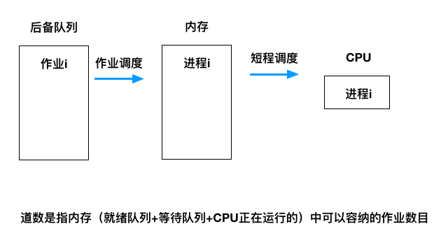
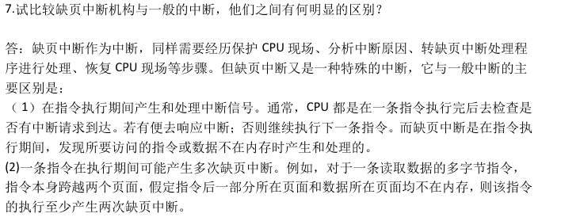
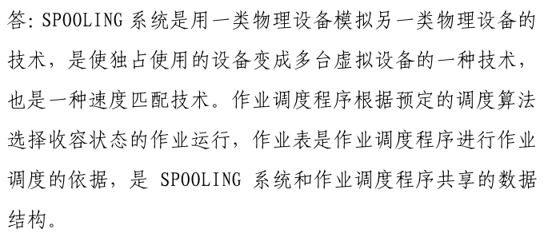
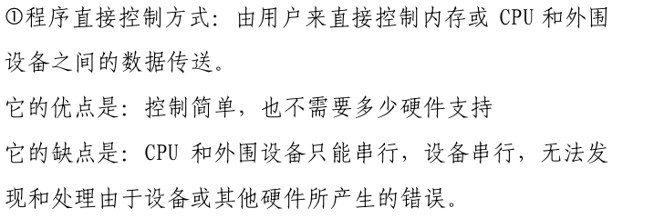
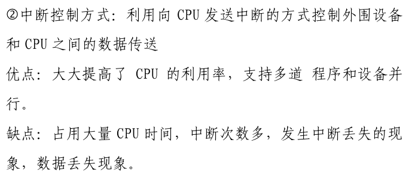
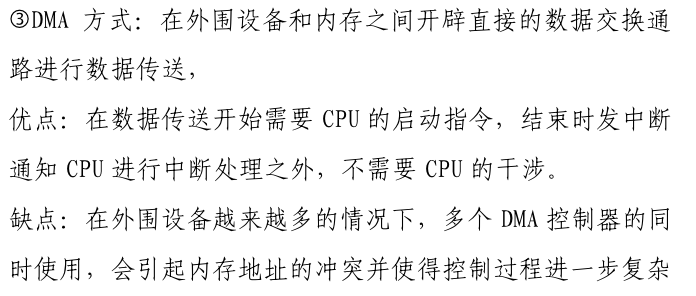
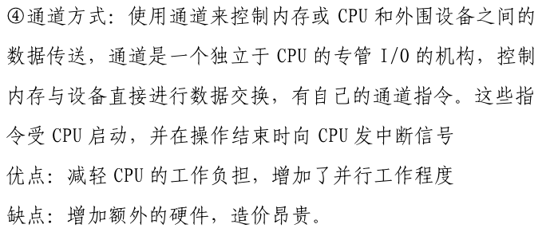
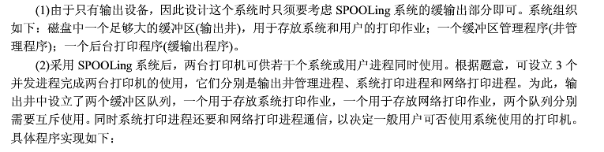
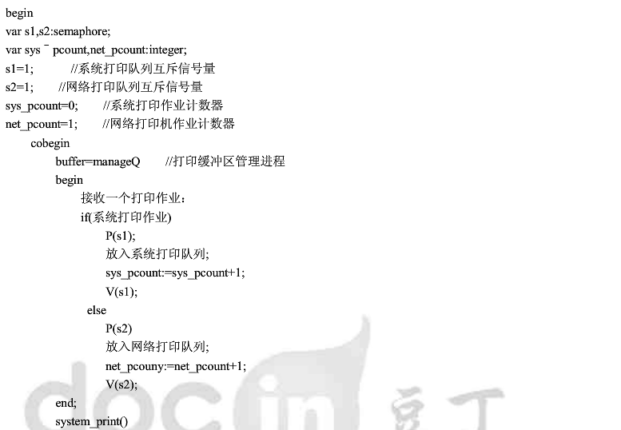
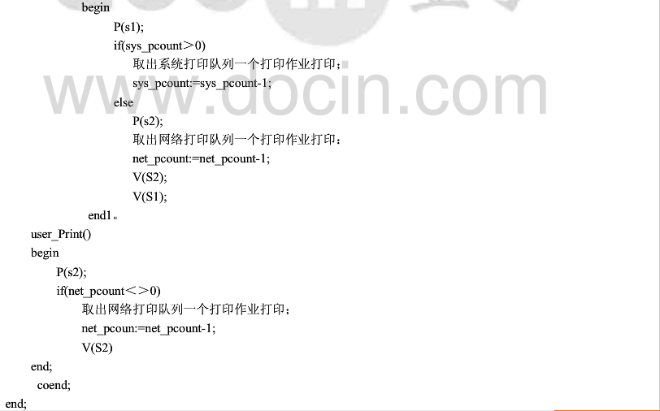

# 课后习题

[TOC]


## chap1

1. 计算机系统组成/层次结构
   * 组成： 软件+ 硬件
   * 层次结构：
     * 应用软件
     * 支撑软件
     * OS（系统软件）
     * 计算机硬件
2. 计算机系统资源
   * 信息资源 ：数据 + 程序
   * 硬件资源： 处理器/外设/内存
3. OS定义/作用 :negative_squared_cross_mark:
   * 定义：操作系统是管理计算机系统资源，控制程序执行，优化人机界面，提供各种服务，合理组织计算机工作流程，为用户方便有效地使用计算机提供良好的运行环境
   * 作用：
     * 服务用户的观点：OS作为用户接口和公共服务程序
     * 进程交互的观点：OS作为进程执行的控制者和协调者
     * 系统实现的观点：OS作为扩展机或虚拟机
     * 资源管理的观点：OS作为资源的管理者和控制者

7. 什么是系统调用，分类 :negative_squared_cross_mark:
   * 系统调用把应用程序的请求传送至内核，调用相应服务例程完成所需处理，姜结果返回给应用程序。
   * 作用：
     * 内核可以基于权限和规则对资源访问进行裁决，保证系统的安全性
     * 系统调用对资源进行抽象，提供一致性接口，避免用户在使用资源时发生错误，且是编程效率大大提高。
   * 分类：
     * 进程管理
     * 文件管理
     * 设备管理
     * 存储管理
     * 进程通信
     * 信息维护

9. 

## chap2 

http://www.docin.com/p-961208247.html

http://www.docin.com/p-83382947.html

https://wenku.baidu.com/view/3b9878bda98271fe900ef96d.html

注意⚠️：

* 响应时间：从交互式进程提交一个请求（命令）到获得响应之间的时间间隔	
  * 所输入的请求命令送到CPU的时间
  * CPU处理请求命令的时间
  * 处理所形成的响应送回到终端显示器的时间
* 周转时间包括：从向系统提交作业开始 到作业完成为止
  * 在后备队列中等待的时间 
  * 进程进入内存后在就绪队列中等待的时间 
  * ..  
  *  直到执行完成



* 时间片轮转算法中：同一时刻时一个进程时间片完,另一个到达,那个会先调用?
  * 先调用刚到达的
  * 相当于，先把刚到达的放入就绪队列尾部，再把刚刚用完时间片的进程放入就绪队列尾部。
* :question: 作业调度和进程调度时：某个时刻，正在运行的作业执行完成，内存有空位，此时既需要从后备作业中调度一个作业进入内存，又要从就绪队列中调度一个进程占有处理器运行。而即将调入作业可能会影响进程调度的结果（可能即将调如的作业优先级最高），那么是先进行作业调度，还是进行进程调度


#### PV管程 -- 阅览室问题

```c++
int number[100];
string name[100];
semaphore seatcount = 100;
semaphore mutex;

cobegin
process reader_i(string name){
    P(seatcount);
    P(mutex);
    	//进入阅览室
    V(mutex);
    V(seatcount);
    	
}
```

```c++
Type read_book = monitor{
    int seat_count = 0;
    semaphore seat = 0;
    int reader_count = 0;
    
    InterfaceModule IM;
    define reader_come,reader_leave;
    use enter,leave,wait,signal;
}
void reader_come(InterfaceModule &IM){
    enter(IM);
    if(reader_count>100){
        wait(seat,seat_count,IM);
    }
    reader_count++;
    //进入阅览室
    leave(IM);
}
void reader_leave(InterfaceModule &IM){
    enter(IM);
    reader_count--;
    signal(seat,seat_count);
}

cobegin
void reader_i(){
    read_book.reader_come();
    //
    read_book.reader_leave();
    //
}
```

#### PV管程 --- 捡棋子

```c++
{
    p(s1);
    
    V(s2);
}
{
    P(s2);
    
    V(s1);
}
```

```c++
Type pick_chess = monitor{
    semaphore white,black;
    int white_count,black_count;
    bool flag;//true:捡白棋子，false：捡黑棋子
    InterfaceModule IM;
    define pickup_white,pickup_black;
    use enter,leave,wait,leave;
}
void pickup_black(){
    if(flag){
        wait(black,black_count,IM);
    }
    //pick up black
    flag = true;
    signal(white,white_count,IM);
}
void pickup_white(){
    if(!flag){
        wait(white,white_count,IM);
    }
    //
    flag = false;
    signal(black,black_count,IM);
}
```

#### PV 管程 -- 信箱问题

```c++
full0 = 0;
empty0 = 3;
full1 = 0;
empty1 = 3;
full2 = 0;
empty = 2;
full3 = 0;
empty3 = 2;

mutex0 = mutex1 = mutex2 = mutex3 = 0;
process0(){
    P(full0);
    P(mutex0);
    //
    V(mutex0);
    V(empty0);
    //process
    P(empty1);
    P(mutex1);
    //
    V(mutex1);
    V(full1); 
}

/////////
full[4] = {0};
empty[4] = {3,3,2,2};
mutex[4] = {0};
process_i(){
    P(full[i]);
  	P(mutex[i]);
    //
    V(mutex[i]);
    V(empty[i]);
    //process
    P(empty[(i+1)%4]);
    P(mutex[(i+1)%4]);
    //
    V(mutex[(i+1)%4]);
    P(full[[(i+1)%4]]);
}
```

```c++
type message = monitor{
    count[4] = {0};
    limit[4] = {3,3,2,2};
    cond p[4];
    int p_count[4];
    InterfaceModule IM;
    define take_i,sent_i;
    use enter,leave,wait,signal;
}
void take_i(InterfaceModule &IM){
    if(count[i]<=0){
        wait(p[i],pcount[i],IM);
    }
    //
    signal(p[(i-1)%4],pcount[(i-1)/4],IM);
}
void send_i(InterfaceModule &IM){
    if(count[(i+1)%4]>=limit[(i+1)%4]){
        wait(p[i],pcount[i],IM);
    }
    //
    signal(p[(i+1)%4],pcount[(i+1)/4],IM)
}
```

#### PV - X-Y

```c++
要求：
    -N < X-Y < M
semaphore X_Y = m-1;
semaphore Y_X = n-1;
semaphore mutex = 1;
void X(){
    while(1){
        P(X_Y);
        P(mutex);
        //
        V(mutex);
        V(Y_X);
    }
}
void Y(){
    while(1){
        P(Y_X);
        P(mutex);
        //
        V(mutex);
        V(X_Y);
    }
}
```

#### PV -- 零件

```C++
semaphore A_B = n-1;
semaphore B_A = n-1;
semaphore empty = m;//二者加起来不超过 m
semaphore emptyA = m-1,emptyB = m-1;//任何一个都不能超过 m-1，否则无法各拿一个进行组装
semaphore fullA = 0,fullB = 0;
semaphore mutex;//互斥访问临界区
void A(){
    while(true){
        P(A_B);
        P(emptyA);
        P(empty);
        P(mutex);
        //
        V(mutex);
        V(empty);//删掉
        V(fullA);
        V(B_A);
    }
}
void B(){
    while(true){
        P(B_A);
        P(emptyB);
        P(empty);
        P(mutex);
        //
        V(mutex);
        V(empty);//删掉
        V(fullB);
        V(A_B);
    }
}
void get(){
    while(true){
        P(fullA);
        P(fullB);
        
        P(mutex);
        //get A
        V(mutex);
        P(mutex);
        //get B
        V(mutex);
        
        V(emptyA);
        V(emptyB);
        V(empty);
        V(empty);
    }
}
```

#### T29 PV -- 发送消息

```c++
//可以想象有n2个缓冲区
semaphore full[n2] = {0};
semaphore empty[n2] = {m};
semahpore mutex = 1;
send(){
    for(int i = 0;i<n2;i++){
        P(empty[i]);
        P(mutex);
        //
        V(mutex);
        V(full[i]);
    }
}
receive(int i){
    P(full[i]);
    P(mutex);
    ///
    V(mutex);
    V(empty[i]);
}
A_i(){
    while(1){
        send();
    }
}
B_i(){
    while(1){
        receive(i);
    }
}
```

## chap4

### 思考题

1. 存储管理
   * 存储分配
   * 地址映射
   * 存储保护
   * 存储共享
   * 存储扩充
2. 存储层次
   * 寄存器
   * 缓存
   * 内存
   * 磁盘
   * 磁带
3. 逻辑地址/物理地址
4. 分区分配策略
   * 固定分区
     * 优点：
       * 能解决单道程序运行在并发环境下不能与CPU速度匹配问题
       * 单道程序运行时内存空间利用率低低问题
     * 缺点：
   * 可变分区


31. 缺页中断与一般中断的区别

    


## chap5

1. spooling和作业调度的关系

   

2. 各种IO控制方式及其优缺点

   

   

   

   

25. 

    

    

    

```c++
semaphore S_sys = S_net = 1;
int sys_count = 0;
int net_count = 0;
void manage(){
    //接收一个打印作业
    if(系统打印作业){
        P(S_sys);
        //放入系统打印机队列
        sys_count++;
        V(S_sys);
    }else{
        P(S_net);
        //放入网络打印机队列
        net_count++;
        V(S_net);
    }
}
void System_Print(){
    
}

```

