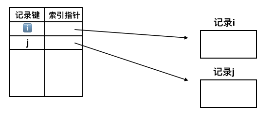
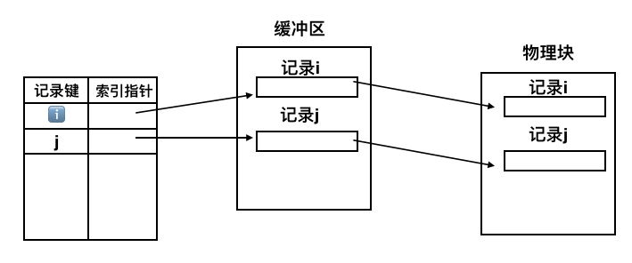

# 操作系统的一些问题

[TOC]

## 文件存取

### 文件存取方法：

**读写**文件存储器上的物理记录的方法

1. 顺序存取：存取操作都在上次操作的基础上进行。

   * 设置读写两个位置指针

   * 主要用于磁带文件，页使用于磁盘上的顺序文件

   * **如果是固定长度记录的顺序文件，则允许采用随机访问，逻辑地址$$[i]$$ = 记录长度 x$i$ **

2. 直接存取：随机存取，可以**非顺序地**从文件中的**任何**位置存取文件内容

   * 顺序编号的物理块组成，这些块划分为等长，作为定位和存取的最小单位
   * 对读或写物理块的次序没有任何限制
   * 用户提供相对块号，是相对于文件开始位置的位移量
   * 对于记录式文件，为每个记录指定关键字，通过**关键字映射**来直接检索和存取

   * 通常用于磁盘文件

3. 索引存取：基于索引文件的存取方法

   * 文件记录不按位置而是按照及记录名或记录键来编址
   * 用户提供记录键 --- > 按名搜索 ----> 查找所需的记录
   * 记录键按照某种顺序存放

## 文件目录

## 文件组织与存储

### 逻辑结构

1. 流式文件：无结构

   * 字节流文件
   * 每个字节有一个索引
   * 使用文件读写指针来访问特定字节
   * 文件打开时，指针指向首指针

2. 记录式文件：有结构

   * 逻辑记录是文件内独立的最小信息单位
   * 通过文件读写指针来指定对文件信息的访问

   两种记录组织和使用方法：

   * 记录式顺序文件：文件的记录**顺序生成** 并被**顺序访问**
   * 记录式索引文件：使用索引表，表项含有记录键和索引指针：记录键由应用程序确定，索引指针指向响应记录

   🉑️：

   * 针对特定记录进行存取
   * 页保存着顺序访问记录的能力

   

3. 成组和分解：

   * 节省存储空间
   * 减少IO操作次数
   * 提高系统效率

   

4. 记录格式

   * 定长记录
   * 变长记录

5. 记录键

### 物理结构

#### 构造物理结构的方法：

1. 计算法
2. 指针法

#### 几种物理结构

1. 顺序文件：（连续文件）逻辑连续 存放在 相邻物理块

   * 逻辑记录顺序和物理块顺序完全一致
   * FCB保存的磁盘定位信息：第一个物理块地址 & 文件信息总块数

   优点：顺序存取快

   缺点：建立文件之前必须预先确定文件长度，修改/插入/添加困难 ， 对于变长记录处理困难 ， 磁盘连续分配造成空闲块浪费

2. 连接文件：使用连接字（指针）指出文件的下一个物理块位置

   * 输入井/输出井

   缺点：连接结构必须将连接字和数据信息混合存放，破坏数据块的完整性；存取信息必须通过缓冲区，获得连接字后，才能找到下一个物理块地址，适宜于**顺序存取**

3. 索引文件

   * 可以用散列存储

   优点：具有直接读写任意记录的能力 ；便于信息的增/删/改

   缺点：索引表的空间开销和查找实践开销大

   * 索引顺序文件：顺序文件的扩展
     * 各条记录在介质上顺序排列
     * 具有直接处理和修改记录的能力
     * 能够快速顺序处理
     * 既允许按物理顺序（记录出现次序）处理
     * 又允许按逻辑顺序（记录键）顺序存取

4. 直接文件：（散列文件/哈希文件）利用哈希法将记录的关键字与其地址建立某种对应关系