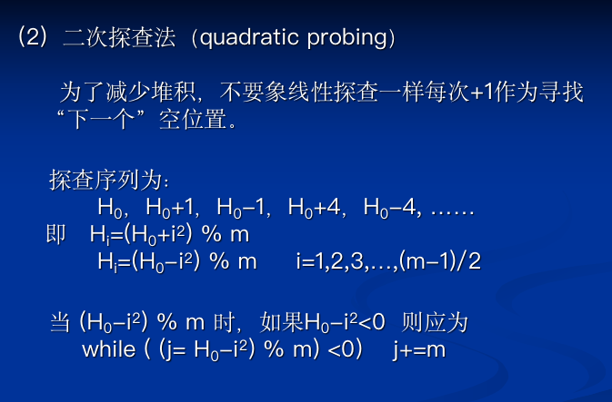
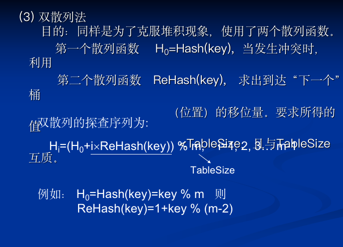
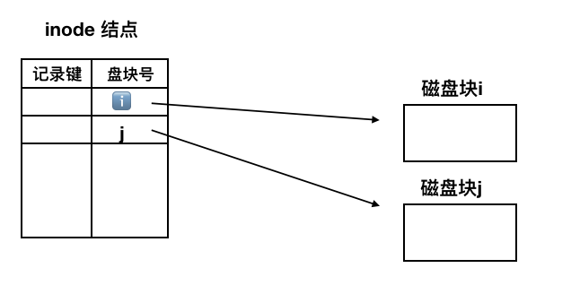
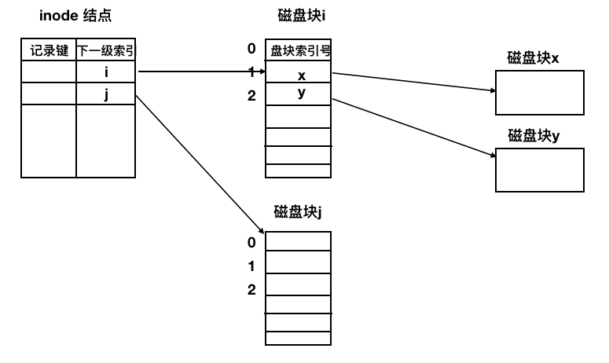

# 王道八套卷

[TOC]


## 王道8套卷1⃣️

#### 代码 -- 判断二叉树是不是AVL树

```c++
类定义见「数据结构-真题-代码.md」
int isAvl(BinaryTreeNode<T> * root){
    if(root==NULL)return 1;
    int leftDepth = getDepth(root->leftChild);
    int rightDepth = getDepth(root->rightChild);
    return leftDepth-rightDepth<=1 && leftDepth-rightDepth<=-1 && isAvl(root->leftChild)&&isAvl(root->rightDepth);
}
int getDepth(BianryTreeNode<T> * root){
    if(root==NULL)return 0;
    int leftDepth = getDepth(root->leftChild);
    int rightDepth = getDepth(root->rightChild);
    return leftDepth>rightDepth?leftDepth:rightDepth;
}
```

#### AOE网-关键路径

* 关键路径是从源点到汇点最长的路径
* 关键路径可能并不唯一
* 各关键路径长度相等
* 关键路径上活动的时间延长多少，整个工期也就延长多少
* 只有为个关键路径所共有的关键活动，且减少它不改变关键路径的前提下，才可缩短工期
* 所有的关键路径一同延长，则关键路径不会改变
* 所有的关键路径一同缩短，则关键路径可能改变


#### 文件存取

* 随机存取时，索引文件更快
* 顺序存取时，顺序文件更快

#### CSMA

* 非坚持
  * 优点：可以减少冲突的可能性
  * 缺点：媒体使用效率低下，会增加网络空闲时间
* 1-坚持：
  * 优点：只要媒体空闲，站点就立即发送
  * 缺点：假如有两个或两个以上的站点需要发送数据，冲突就不可避免
* p-坚持：
  * 可以减少网络空闲时间

#### 进栈出栈序列与二叉树

由于二叉树的前序和中序遍历可唯一确定一棵二叉树

因此，把进栈序列看作**前序遍历**，出栈序列看作**中序遍历**

此时，进栈序列确定时，出栈序列的种类就相当于 二叉树的种类：也就是卡特兰数

「对应过程」：

* 一个结点入栈后立刻出栈，则没有左孩子
* 一个结点入栈后下一个结点进栈，则下一个结点是左孩子
* 一个结点出栈后下一结点继续出栈，则没有右孩子
* 一个结点出栈后下一结点进栈，则下一结点是右孩子

#### OSI参考模型和TPCP/IP

* OSI
  * 网络层：支持面向连接和无连接
  * 传输层：仅有面向连接方式
* TCP/IP：认为可靠性时端到端的问题
  * 网络层：仅支持无连接方式
  * 传输层：支持无连接和面向连接方式


#### 缺页中断与一般中断的区别

* 在指令执行期间产生和处理中断信号，CPU通常是在一条指令执行完后检查是否有中断请求，而缺页中断是在指令执行期间，发现所有访问的指令或数据不在内存时产生和处理的
* 一条指令在执行期间可能产生多次缺页中断。

#### 有效访存时间

* 要访问的页面在内存中：两次访问内存  ：访问内存页表  +  访问内存
* 要访问的页面不在内存中：访问内存页表  +  中断处理（缺页中断）+ 访问内存页表 + 访问内存

#### 网络地址

| 特殊地址             | 网络号 | 主机号 | 源地址或目的地址 |                                            |
| -------------------- | ------ | ------ | ---------------- | ------------------------------------------ |
| 网络地址             | 特定的 | 全0    | 都不是           |                                            |
| 直接广播地址         | 特定的 | 全1    | 目的地址         | 用于向特定子网的所有主机发送广播           |
| 受限（本地）广播地址 | 全1    | 全1    | 目的地址         | 在不知道网络号时向本地网络中的主机发送广播 |
| 这个网络上的主机     | 全0    | 全0    | 源地址           |                                            |
| 这个网络上的特定主机 | 全0    | 特定的 | 源地址           |                                            |
| 环回地址             | 127    | 任意   | 源地址或目的地址 |                                            |


## 王道8套卷2⃣️

#### 解决冲突的算法






#### 前序遍历 -- 中序遍历

前序是  VLR ：根 - 左 - 右

中序是 LVR ： 左 - 根 - 右

咋就老搞混呢 :sweat:

#### B-树

非叶子结点仅起索引作用，每次查找一定会查找到某个叶结点 :x:

这是 B+树的特点；B树非叶子结点也是关键码

#### DFS

深度优先遍历每次遍历到头时，回溯到**上层结点**，寻找上层结点的下一孩子

#### IO方式

* 程序查询：只需要软件
* 程序中断：软硬件结合
* DMA：只需要硬件
* 通道：软硬件结合

#### 滑动窗口

窗口为n时：接收窗口 >= 1 所以发送窗口 <=n-1，最多有n-1个帧已发送但为确认

#### 连续ARQ

* GBN： 发送窗口 ： $WT <= 2^n -1 $
* SR(选择重传)： 发送窗口 ：$WT <= 2^{n-1}$


#### 地址分配

* 选择该网络最小的地址分配给路由器接口

#### 子网划分

#### 路由表结构


| 目的网络地址           | 子网掩码  | 下一跳地址  | 接口 |
| ---------------------- | --------- | ----------- | ---- |
|                        |           | 直接        | a    |
|                        |           | xx.xx.xx.xx |      |
| 61.0.0.0（因特网地址） | 255.0.0.0 | 直接        | d    |
| 0.0.0.0                | 0.0.0.0   | 61.60.21.80 | d    |


#### 代码 -- 求第k层的叶子结点数

```c++
//设根结点为第一层
//对于以结点R为根的子树，如果结点R在第ℹ️层，那只要求该子树中第 k-ℹ️+1层的叶子结点数
//比如 ： 根结点在第1层，k - 1 + 1 = k
//对于第二层结点，只要求  k - 2 + 1 = k-1层的叶子结点数

int getLeafNum(BinaryTreeNode<T> * root ,int k){
    if(root==NULL){return 0;}
    if(root->leftChild==NULL&&root->rightChild==NULL&&k==1){//到达第k层，并且是叶子
        return 1;
    }
    int left = getLeafNum(root->leftChild,k-1);
    int right = getLeafNum(root->rightChild,k-1);
    return left+right;
}

//主调函数为getLeafNum(root,k);
```

## 王道八套卷3⃣️

#### 只能在内核态**执行**的指令是

A 读时钟 B 寄存器置零 C系统调用 D取数 

选C

* 系统调用发生在用户态，但要转到核心态执行
* 内核功能包括：时钟管理/中断机制/原语/系统控制的数据结构记处理（系统调用类的指令）
* A/B/D 都可以在在汇编语言中涉及，因此可以运行在用户态

####  管理外存对换区的管理

目标：提高换入/换出速度

#### 物理文件的多级索引分配方法

1. 直接索引

   

2. 一级索引

   

3. 二级索引

4. 三级索引

#### 以太网冲突检测

最小帧长 = 总线传播时延 X  数据传输速率  X 2

#### TCP/IP报文分组和排序

排序工作由传输层完成

重组工作由网络层完成


#### :x: 拥塞控制 -- 发送窗口 -- 拥塞窗口 -- 接收窗口

#### :x: 香农定理


#### 代码 -- 求旋转数组的最小元素

```c++
int RotateMIN(int a[],int n){
    int min;
    for(int i = 0;i < n-1 ;i++){
        if(a[i+1]<a[i]){
            min = a[i];
            break;
        }
    }
	return min;
}
```


## 王道8套卷4⃣️

#### 图中相关概念

* 连通图，任意两个顶点都是相通的（不代表任意两个顶点都有弧）
* 连通分量：无向图中的**极大**连通子图
* 生成树：包含无向图中全部顶点的**极小**连通子图


#### 归并排序

当有奇数个归并段时，最后一个归并段无需和其他归并段归并，本趟轮空

#### :x: Next 数组


#### DMA和中断

* 和中断方式相比，DMA连接的是高速设备，其优先级高于中断请求，以防数据丢失
* DMA请求的响应可以发生在每个机器周期结束时，只要不占用总线
* 中断请求的响应时间只能发生在每条指令执行完毕
* DMA优先级高于外中断，所以DMA优先级比非屏蔽中断请求要高
* 如果不开中断，那么非屏蔽中断（以及内中断）仍可响应
* DMA方式的预处理和后处理中，需要CPU干预，在传送过程中不需要CPU干预


#### 进程状态

* 从运行态到阻塞态的转换时进程的自主行为

  （block原语是由被阻塞进程自我调用实现的）

* 从阻塞态到就绪态到转换是由协作进程决定的

  (Wakeup 是由一个被唤醒金层呢相合作或其他相关进程调用实现的)


## 王道8套卷5⃣️

#### 微内核

* 将内核中最基本的功能（如进程管理，虚存管理等）保留在内核，将那些不需要在核心态执行的部分移到用户态执行
* 需要频繁地在管态和目态缺环
* 操作系统执行开销相对较大
* 效率低
* 更安全/更可靠
* 想添加新任务时，不必修改内核

#### :x: 各个IO层次的作用


#### 路由器

* 可以支持多种网络层协议，并提供不同协议之间的分组转换


## 王道8套卷6⃣️

#### 代码 -- 求根结点到某结点之间的路径

```c++
//非递归后续遍历

void PostOrderTraverse(BiNode * root){
    InitStack(S);
    BiNode curr = root;
    BiNode pre = root;
    while(curr != NULL && !S.empty()){
        if(curr != NULL){
            S.push(curr);
            curr = curr.lchild;
        }else{
            //查看当前栈顶元素
            curr = S.top()
            //如果其右子树也为空，或者右子树已经访问
            //则可以直接输出当前节点的值
            if(curr.right == NULL||curr.rchild == pre){
                visit(top);
                S.pop();
                pre = curr;  // visit 后 将此节点设为pre , pre只标注上一个被visit的节点，只有这一段代码进行了visit
                curr = NULL; // 这个节点的子树访问结束
            }else{
                curr = curr.rchild;
            }
        }
    }
}
//改造一下

void postOrder(BinaryTreeNode<T> * root,int k){
    Stack<BinaryTreeNode<T>> stack;
    BianryTreeNode<T> current = root;
    BianryTreeNode<T> pre = root;
    stack.push(current);
    while(!stack.empty()&&current!=NULL){
        if(current!=NULL){
            stack.push(p);
            current = current->leftChild;
        }else{
            current = stack.top();
            if(current.rightChile==NULL || current.rightChile == pre ){
                if(current.data == k){break}
                stack.pop();
                pre = current;
                current = NULL;
            }else{
                current = current.rightChild;
            }
        }
    }
    while(current!=NULL){
        print(current.data);
        stack.pop();
    }
}

```

####  m路平衡归并

设有 $N_m$个内结点，$N_0$个外结点（叶子结点）则

$N_0 + N_m = m * N_m + 1$

从而：

$N_0 - 1 = (m-1) * N_m$

$(N_0 - 1)/(m-1) = N_m$

故：

$(N_0 - 1) \% (m - 1) = 0$

如果上式不成立，就需要添加空叶子结点以增大$N_0$使之成立


## 王道8套卷7⃣️

#### 代码 - 求最大数对差

数组中，一个数字减去它右边的数字得到一个数对之差，求所有数对之差的最大值

###### 分治法

```c++
//采用分治的思想，差最大的数对（a，b）之有三种情况
//a,b 都在数组的左半部分
//a,b 都在数组的右半部分
//a 在左半部分，b在右半部分
#include<math>
int getMaxSubstraction(int a[],int low, int high){
    int mid = (low+high)/2
    int leftSubstraction = getMaxSubstraction(a,low,mid);
    int rightSubstraction = getMaxSubstraction(a,mid+1,high);
    int leftMax = leftTemp;
    int rightMin = rightTemp;
    for(int i=mid;i>=0;i--){
        if(a[i]>leftMax)leftMax = a[i];
    }
    for(int j = mid+1;j<=high;j++){
        if(a[j]<rightMin)rightMin = a[j];
    }
    return math.Max(math.Max(leftSubstraction,rightSubstraction),leftMax-rightMin);
}

```

时间复杂度为 $nlogn$

###### 动态规划法

由题目可知，每个数对，都是左边的数减右边的数

当扫描的第$i$个数字时，只需在$i$之前找到一个最大的 $a[j] $, 这个$a[j]-a[i]$ 便是所有以$i$为减数的数对中最大的

一趟扫描，当扫描到第$i$个数字时，存储$i$前面找到的j

当扫描到第 $i+1$ 个数字时，想要找 $i+1$ 前面最大的数， 这个最大的数，要么是刚刚找到的$ j$ ，要么是$i$

```c++
int getMaxSubstraction(int a[],int n){
    if(a==NULL||n<2)return 0;
    int max = a[0];//当前元素前面 的 最大元素
    int maxSubstraction = max - a[0];
    for(int i = 2;i<length;i++){
        if(a[i-1]>max){
            max = a[i-1];
        }
        int thisSubstraction = max-a[i];
        if(thisSubstraction > maxSubstraction){
            maxSubstraction = thisSubstraction;
        }
    }
    return maxSubstraction;
}
```

时间复杂度 为 $O(n)$


#### 重定位

页式存储方式可以采用静态重定位 :x:

静态重定位是在程序运行之前由装配程序完成的，页式存储不是连续的，而且页式存储管理方案在运行过程中可能改变程序位置，分配的时候会把相邻逻辑地址映射到不同的物理位置，因此需要动态重定位


####  文件访问

一个文件的访问，通常由用户访问权限和**文件属性**共同限制


## 王道8套卷8⃣️

####  进程优先级

IO型高于计算行

系统进程高于用户进程


####  代码 -- 判断单链表是否有环

快慢指针

```C++
int hasLoop(LinkedNode<T> * head){
    LinkedNode<T> fast = head;
    LinkedNode<T> slow = head;
    while(fast->link!=NULL & fast->link->link !=NULL){//如果没有环，当遍历到最后一个结点时，两步中总有一步是NULL
        fast = fast->link->link;
        slow = slow->link;
        if(slow == fast ){return 1}
    }
    return 0;
}
```

####  通道

通道是 **硬件** 或特殊的处理器 不是软件

通道没有自己的内存，通道指令放在主机的内存中，和CPU共享内存

为了实现设备的独立性，用户使用的是**逻辑设备号**

来自通道的中断事件是属于输入输出问题，应有**设备管理**负责


#### 虚拟存储器

在段页式系统中以段为单位管理用户的逻辑空间，以页为单位管理内存的物理空间，有了虚拟存储器才允许用户使用比内存更大的地址空间

#### 调度策略

先来先服务有利于CPU繁忙型作业，不可以IO繁忙型作业

FCFS有利于长作业，不利于短作业，IO繁忙型作业需要频繁进行IO操作，操作完成后还要重新排队


#### 进程线程

线程共享进程的逻辑地址哦你关键，但各个线程有自己的栈空间

