# 软工真题-期末题

注：答案来自：自己写，学长笔记，购买的习题集配套答案

[TOC]

⚠️：目前还没掌握

🇨🇳：很重要但没掌握

:white_check_mark: ：重要但目前掌握

:coffee:: 不那么重要，喝杯 Java休息一下

:x:：还没搞懂

## 期末A卷

### 一 名词解释

1. 软件工程
   * 应用系统的、规范的、可量化的方法来开发、运行和维护软件
   * 对其中各种方法的研究

2. :warning: 软件演化生命周期模型
   * 初始开发  --->  演化  ---> 服务  --->  逐步淘汰  ---->  停止  
3. :warning: 螺旋模型
   * 版本一 ：按照风险解决的方式来组织软件开发活动
   * 版本二：
     * 是一种周期性的方法进行系统开发
     * 有许多"中间版本"
     * 每个周期都包括续期定义、风险分析、工程实现、和评审 四个阶段

### 二 解答题

#### appStore& &googlePlay

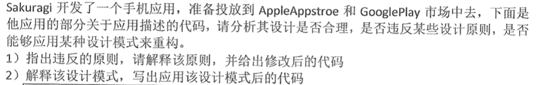

```java
public class Application{
    private String applicationName;
    private float averageRate;
    private ArrayList<NewFeature> newFeatureItems = new ArrayList<NewFeature>();

    public static String getDescriptionForIOS(){
        StringBuffer result = new StringBuffer();
        result.append("This is "+ this.applicationName + " for IOS platform\n");
        for(int i= 0;i<newFeatureItems.size();i++){
            result.append(newFeatureItems.get(i).getDescription);
        }
        result.append("Average Rate from APP Store\n");
        result.append(String.valueOf(avarageRate));
        return result.toString();
    }

    public static String getDescriptionForAndriod(){
        StringBuffer result = new StringBuffer();
        result.append("This is "+ this.applicationName + " for Andriod platform\n");
        for(int i= 0;i<newFeatureItems.size();i++){
            result.append(newFeatureItems.get(i).getDescription);
        }
        result.append("Average Rate from Google Play\n");
        result.append(String.valueOf(avarageRate));
        return result.toString();
    }
}
```


###### 解答: OCP + 迪米特法则 + DonotRepeat

违反了OCP原则：对扩展开放，对修改关闭（当IOS平台或者安卓平台其中⼀一⽅方 发⽣生变更更时会导致另⼀一⽅方也被修改(因为在同⼀一个类中，⽆无论⽅方法是否变更更，都算修改)。所以应将两 个逻辑上并⽴立的代码分开封装，并抽象⼀一个统⼀一的接⼝口 ）

违反了DO not repeat：有相同逻辑代码

违反了迪米特法则：一个软件实体应尽少地与其他软件实体发生相互作用（for循环中出现隐式⽅方 法，所以应该使⽤用迭代器器访问集合对象，减少与其他类的交互)。改进后的代码如下 

###### 改进1:

```java
/*
 * 违反了OCP和迪米特法则
 * 修改
 */
public class Application{
    private String applicationName;
    private float averageRate;
    private ArrayList<NewFeature> newFeatureItems = new ArrayList<NewFeature>();

    private Phone phone;
    Phone = new AndriodPhone();
    //Phone = new Iphone();

    public static String getDescription(){
        StringBuffer result = new StringBuffer();
        result.append("This is "+ this.applicationName + " for" + phone.getPlatformName()+ " platform\n");


        for(int i= 0;i<newFeatureItems.size();i++){
            result.append(newFeatureItems.get(i).getDescription());
        }
        // for循环隐式访问方法，应该使用迭代器
        Iterator<NewFeature> it = newFeature.iterator();
        while(it.hasNext()){
            result.append(it.next().getDescription());
        }


        result.append("Average Rate from "+ phone.getSourceName()+"\n");
        result.append(String.valueOf(avarageRate));
        return result.toString();
    }
}
public interface Phone{
    public String getSourceName();
    public String getPlatformName();
}
public class AndriodPhone implements Phone{
    private String sourceName = "Google Play";
    private String platformName = "Andriod";
    public String getSourceName(){
        return this.sourceName;
    }
    public String getPlatformName(){
        return this.platformName;
    }
}
public class Iphone implements Phone{
    private String sourceName = "APP Store";
    private String platformName = "IOS";
    public String getSourceName(){
        return this.sourceName;
    }
    public String getPlatformName(){
        return this.platformName;
    }
}
```

###### 使用策略模式

```java

/*
 * 使用策略模式
 */

public class TestCase{
    public void test(){
        Application andriodApp = new Application();
        andriodApp.setApplicationName("淘宝");
        andriodApp.setAverageRate(0.7);
        andriodApp.setNewFeatureItems(new ArrayList<NewFeature>());

        Device andriod = new Andriod();
        andriodApp.setDevice(andriod);
        andriodApp.getDescription();

    }
}

public class Application{
    private String appicationName;
    private float averageRate;
    private ArrayList<NewFeature> newFeatureItems = new ArrayList<NewFeature>();

    private Device device;

    public void setDevice(Device device){
        this.device = device;
    }

    public String getSourceName(){
        device.getSourceName();
    }
    public String getPlatformName(){
        device.getPlatformName();
    }
    public String getDescription(){
        StringBuffer result = new StringBuffer();
        result.append("This is "+ this.applicationName + " for"+ getPlatformName() +" platform\n");
        // for循环隐式访问方法，应该使用迭代器
        Iterator<NewFeature> it = newFeature.iterator();
        while(it.hasNext()){
            result.append(it.next().getDescription());
        }
        result.append("Average Rate from " + getSourceName()+ "\n");
        result.append(String.valueOf(avarageRate));
        return result.toString();
    }
}
public interface Device{
    public String getSourceName();
    public String getPlatformName();
}
public class Andriod implements Device{
    public String getSourceName(){
        return "Google Play";
    }
    public String getPlatformName(){
        return "Andriod";
    }
}
public class IOS implements Device{
    public String getSourceName(){
        return "App Store";
    }
    public String getPlatformName(){
        return "IOS";
    }

}
```

###### 使用工厂模式

```java
/*
 使用工厂模式
 */

interface App{
    public String getDescription();
}
public class IOS implements App{
    public String getDescription(){

    }
}
public class Andriod implements App{
    public String getDescription(){

    }
}
interface Factory{
    public App createApp();
}
public class iosApp implements Factory{
    public App createApp(){
        return new IOS();
    }
}
public class andriodApp implements Factory{
    public App createApp(){
        return new Andriod();
    }
}
```

#### 影片出租店程序

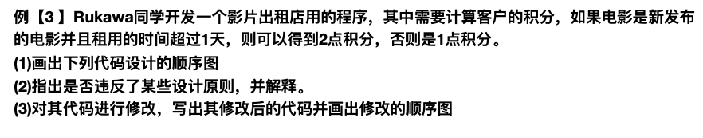

```java
public class Customer{
    Rental rental;
    int getNewRentPoint(){
        Movie m = rental.getMovieRented();
        if((m.getPriceCode == Movie.NEW_RELEASE)&& rental.getDaysRented()>1){
            return 2;
        }else {
            return 1;
        }
    }
}
public  class Rental{
    private int daysRented;
    private Movie movieRented;


    private int getDaysRented(){
        return daysRented;
    }
    public Movie getMovieRented{
        return movieRented;
    }
}
public class Movie {
    private int priceCode;
    public static final int CHILDRENS = 2;
    public static final int REGUALR = 20;
    public static final int NEW_RELEASE = 1;

    public int getPriceCode{
        return priceCode;
    }
}
```


###### 解答：迪米特法则

违反了迪米特法则：一个软件实体应尽可能少与其他软件实体发生相互作用

代码顺序图


```java

/*
 违反了迪米特法则
 */


public class Customer{
    Rental rental;
    int getNewRentPoint(){
        rental.getMovieRentPoint();
    }
}
public  class Rental{
    private int daysRented;
    private Movie movieRented;

    public int getDaysRented(){
        return daysRented;
    }

    public int getMovieRentPoint{
        if(movieRented.getPriceCode == Movie.NEW_RELEASE && this.getDaysRented()){
            return 2;
        }else{
            return 1;
        }
    }
}
public class Movie {
    private int priceCode;
    public static final int CHILDRENS = 2;
    public static final int REGUALR = 20;
    public static final int NEW_RELEASE = 1;

    public int getPriceCode{
        return priceCode;
    }
}
```

修改后的代码顺序图


1. eclipse 中人机交互优点和体现的人机交互原则
   * 简洁：不要使用太大的菜单，不要在一个窗口表现过多的信息类别
   * 一致性:依据精神模型，不要让按钮的位置不一样
   * 低出错率设计：提供简洁的指导帮助用户消除错误，用户输入错误信息，系统会标注出来，而不是让用户重写整段代码
   * 易记性：减少用户的记忆负担，使用逐层递进的范式展示信息，并且小功能使用直截了当的图像快捷方式
     * 减少短期记忆负担
     * 逐层展示信息
     * 使用直观的快捷方式
     * 设置有意义的默认值


#### 栈设计的合理性


```java
public class MyStack extends Vector{
	public void push(Object element){
        insertElementAt(element,0);
    }
    public Object pop(){
        Object result = firstElement();
        removeElementAt(0);
        return result;
    }
}
```

###### 解答：LSP

不符合LSP：子类可以替换父类并起到相同的作用

（1. Vector 中的size和isEmpty 栈中并没有，这样修改了父类的接口

	2. 只为了了复⽤用⽽而不不为了了组织类型差异的继承⽤用法通常是不不符合⾥里里⽒氏 替换原则的，并建议使⽤用组合代替继承 ）

```java
public class MyStack{
    Vector vector = new Vector();
    public void push(Object element){
        vector.insertElement(element,0);
    }
    public Object pop(){
        Object result = vector.firstElement();
        vector.removeElement(0);
        return result;
    }
}
```

#### 设计雇员类


```java
public class person{
    private string name;
    public string getName(){
        return name;
    }
}
public class employee extends Person(){
    
}
```

######	解答：LSP

子类表达一个特殊类型，而不是一个扮演角色，违反LSP

```java
//组合
public class person{
    private string name;
    public string getName(){
        return name;
    }
}
public class employee{
    public Person person = new Person();
    public string getName(){
        person.getName()
    }
}
```

```java
//接口
public interface Person{
    public string getName();
}
public class employee implements Person{
    public string name;
    public string getName(){
        
    }
}
```

#### 判断内聚耦合

##### 1. P227课后题

```java
validate_checkout_request(input_form i){
	if(!valid_string(i.name)){
        error_message('"invalid name"');
    }
    if(!valid_month(i.date)){
        error_message('invalid month');
    }
    
}
int valid_month(date d){
    return d.month>1 && d.month <=12;
}
```

###### 解答：印记耦合 + 通信内聚

两个函数之间印记耦合（PPT答案里说是数据耦合），第一个函数内部通信内聚

##### 2. 判断耦合并修改

```java
void validdata_checkout_request(input_form i){
    if(!valid(i.name,STRING)){
        error_message("invalid name");
    }
    if(!valid(i.data,DATE)){
        error_message("invalid month");
    }
}
int valid(string s, int type){
    switch(type){
        case STRING:return strlen(s) < MAX_STRING_SIZE;
        case DATE:
            date d = parse_date(s);
            return d.month >=1 && d.month <=12;
    }
}
```

###### 解答：控制耦合

###### 改进：拆成数据耦合和印记耦合

```java
void validdata_checkout_request(input_form i){
    if(!valid_string(i.name)){
        error_message("invalid name");
    }
    if(!valid_date(i.date,){
        error_message("invalid month");
    }
}
int valid_string(string s){

}
int valid_date(string s){
    
}
```

#### 逆向写ATM需求

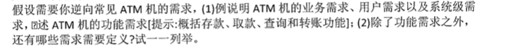

* 业务需求：提供在线转账服务
* 用户需求：允许用户查询余额
* 系统需求：在用户点击退卡时，系统应将银行卡从卡槽中推出
* 功能：系统应提供存款服务
* 性能：所用用户操作在3秒内得到响应
* 质量属性：在发生网络故障时，系统不能故障
* 对外接口：系统与数据库系统的接口
  * 异常处理要求：如果方法抛出异常，数据回滚为未操作前的状态
* 约束：用java开发
* 数据：系统要存储一年的操作记录

需求分类：功能，性能，质量属性，对外接口，约束

#### :x: 设计测试用例

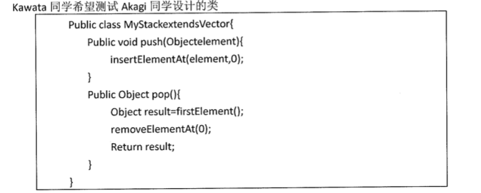


###### 解答

参考答案（不太靠谱）


#### 人机交互

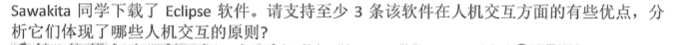


###### 解答：

* 简介设计：不要再一个窗口展示太多信息
* 一致性设计：按钮的相对位置相同
* 低出错率设计：使用简洁的方式指导用户，在用户出错的时候，指出出错的一行
* 易记性设计：
  * 减少短期记忆负担，代码提示
  * 使用逐层递进的方式展示信息，：多级目录展示
  * 使用直观的快捷方式，使用直观快捷方式
  * 设置有意义的默认值：默认创建 main函数

#### 个人是所得税系统

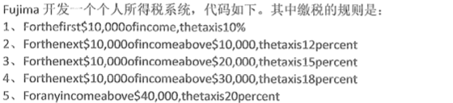

```java
/*
    个人所得说系统
    用决策表来优化
 */

/*
    题目：
        小于 10000 tax is 10%
        大于 10000 小于 20000 的部分 12%
        大于 20000 小于 30000 的部分 15%
        大于 30000 小于 40000 的部分 18%
        大于 40000 的部分 20%
 */
class Main{
    public int calculateTax(int taxable_income){
        int tax = 0;
        if(taxable_income == 0){
            //goto Exit;
            return 0;
        }
        if(taxable_income > 10000){
            tax = tax + 1000;//10000以下的那部分税
        }else{
            tax = tax + taxable_income * 0.1;
            //goto Exit;
            return tax;
        }
        if(taxable_income > 20000){
            tax = tax + 1200;
        }else {//小于20000
            tax += (taxable_income-10000)*0.12;
            return tax;
        }
        if(taxable_income > 30000){
            tax = tax + 1500;
        }else {//小于 30000
            tax += (taxable_income-20000)*0.15;
            return tax;
        }if(taxable_income > 40000){
            tax = tax + 1800;
            tax += (taxable_income-40000)*0.2;
        }else {
            tax += (taxable_income-30000)*0.18;
            return tax;
        }
        return tax;
    }
}
```


###### 解答：决策表

```java

/*
    修改
 */

int[] percent = {10%,12%,15%,18%,20%};
int[] bracket = {0,10000,20000,30000,40000};
int[] base = {0,1000,1200,2200,3700,5500}

public int calculateTax(int taxable_income){
    int level = 1;
    for(int i=0;i<5;i++){
        if(taxable_income > bracket[i]){
            level++;
        }
    }
    int tax = base[level] +(taxable_income - bracket[level])*percent[level];
    return tax;
}

/*
    参考表驱动编程  P307
 */

int[] prePoint = {1000,2000,5000};
int[] postPoint = {1000,2000,5000};
int[] levelArray = {1,2,3};
public int calculateLavel(int prePoint ,int postPoint){
    for(int i=0;i<3;i++){
        if(prePoint < prePoint[i] && postPoint >= postPoint[i]){
            return levelArray[i];
        }
    }
}
```


## 期末B卷

### 名词解释

1. 软件工程
   *
2. 软件验证与确认
   * 验证：检查开发者是否正确地使用技术建立系统，确保系统能够在预期的环境正按照技术要求正确地运行。
   * 确认：检查开发者是否建立了正确的系统，确保最终产品符合规格。
   * （验证和确认是测试的两个层面，前者指软件过程，后者指交付结果。验证多是针对设计而言的，确认是对应需求而言的。验证是看期望的结果经过指定的过程和参数能否实现，确认是要看到底有哪些期望，是否与用户需求相符）

3. 增量开发模型和迭代开发模型
   * 需求驱动
   * 增量迭代模型在项目开始时，通过系统需求开发和核心体系结构设计活动完成项目对前景和范围的界定，然后再将后续开发活动组织为多个迭代，并行的瀑布式开发活动。

###解答题

#### 图书馆借书类

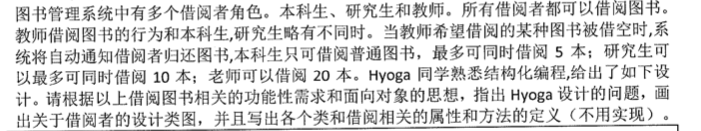


###### 解答：违反OCP开闭原则和单一职责原则

###### 修改1-用接口

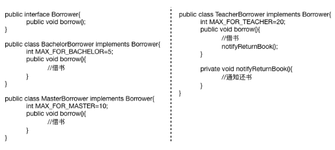

###### 修改2 -用抽象类

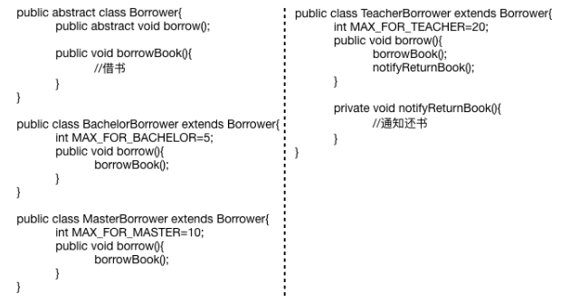

#### Sales类getTotal()-迪米特


###### 解答：通信内聚


```java
class Sales{
    public int getSubtotal(int commodityId){
        SalesLineItem salesLineItem = SalesLineItemMap.get(commodityId);
        return salesLineItem.getSubtoal();
    }
}
class SalesLineItem{
    Commodity commodity;
    int nums;
    public getSubtotal(){
        return commodity.getPrice * nums;
    }
}
class Commodity{
    int price;

    public int getPrice() {
        return price;
    }

    public void setPrice(int price) {
        this.price = price;
    }
}
```

#### 正方形-长方形-LSP

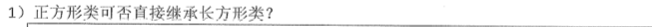


```java
/*
    长方形和正方形
 */
class Rectangle{
    int length;
    int width;

    public int area(){
        return length*width;
    }

    public int getLength() {
        return length;
    }

    public void setLength(int length) {
        this.length = length;
    }

    public int getWidth() {
        return width;
    }

    public void setWidth(int width) {
        this.width = width;
    }
}
```

###### 解答：LSP

违反里氏替换法则：子类必须能够提换基类并起到相同的作用

```java
/*
    组合代替继承
 */

class Square{
    Rectangle rectangle;
    int edge;
    public Square(int edge){
        rectangle = new Rectangle(edge,edge);
    }
    public void setEdge(int edge) {
        this.rectangle.setWidth(edge);
        this.rectangle.setWidth(edge);
    }
    public int area(){
        return rectangle.area();
    }
}
```

#### 前50名成绩-- 内容耦合


```java
public class Grade{
    public float averageGradefroTop50(ArrayList<Student>allStudent){
        ArrayList<Student> sortedStudent = allStudent;
        int totalGrade = 0;
        for(int i=0;i<50;i++){
            totalGrade += sortedStudent.get(i).getGrade();
        }
        double averageGrade = totalGrade/50.0;
        return allStudent;
    }
}
```

###### 	解答：内容耦合

修改

```java
/*
    方法一： 利用组合
 */
public class Grade{
    ArrayList<Student>sortedStudet;

    public ArrayList<Student> getSortedStudet() {
        return sortedStudet;
    }

    public void setSortedStudet(ArrayList<Student> sortedStudet) {
        this.sortedStudet = sortedStudet;
    }

    public float averageGradefroTop50(){
        int totalGrade = 0;
        for(int i=0;i<50;i++){
            totalGrade += this.sortedStudent.get(i).getGrade();
        }
        double averageGrade = totalGrade/50.0;
        return averageGrade;
    }
}
/*
    另一种方法：迭代器
 */
public class Grade{
    public float averageGradefroTop50(ArrayList<Student>allStudent){
        ArrayList<Student> sortedStudent = allStudent;
        Iterator<Student> iterator = sortedStudent.iterator();
        int totalGrade = 0;
        for(int i=0;i<50;i++){
            Student student = iterator.hasNext();
            totalGrade += student.getGrade();
        }
        double averageGrade = totalGrade/50.0;
        return allStudent;
    }
}
```
#### ATM 用例图&顺序图


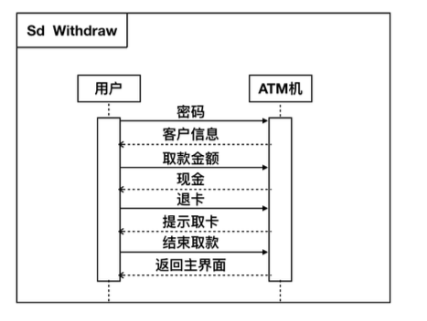

#### :x: 设计测试用例和测试代码 


###### 解答: 见2013年真题解答

参考答案（感觉不太靠谱）


#### 人机交互原则（略）


#### 决策表优化--求每月天数

###### 解答

```java
class main{
    int[] days = {31,28,31,30,31,30,31,31,30,31,30,31}
    int getDaysofMonth(int month){
        return days[i-1];
    }
}
```

#### 质量保障活动（略）

* 需求开发  需求评审，需求度量
* 体系结构  体系结构评审，集成测试
* 详细设计  详细设计评审，设计度量，集成测试
* 软件构造  代码评审，代码度量，测试（测试驱动、持续集成）
* 软件测试  测试，测试度量

#### 内聚性判断


###### 解答：时间内聚

改进


#### 图书馆用例图-建模过程


###### 解答：


#### 人机交互原则略）

#### 黑盒白盒各自优缺点

白盒优点：覆盖率高；发现的缺陷较多

白盒缺点：测试开销大；不能检验需求规格

黑盒优点：测试效率高；可以检验需求规格

黑盒缺点：覆盖率低：发现的缺陷少

#### 白盒测试方法

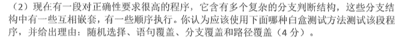

采用路径覆盖：确保程序中每条独立的路径都被至少执行一次

注：几种覆盖：

* 语句覆盖：确保被测试对象中的每一行程序都被至少执行一次
* 条件覆盖：确保程序中每个判断的结果都至少满足一次

## 16期末回忆

### 写在前面

考试内容摘自小笼包的考场回忆。

以下内容中，您可能会看到：

- 不准确的分数划分（按照当时记下来的内容的确是120分……原因不明（附加题吗？））
- 模糊的题目描述
- 不准确或错误的记叙
- 因课程大纲改革带来的可能的题目差异

希望您在参考本文档时能多思考而并非填鸭式抱佛脚。

预祝各位考出理想的成绩！

欢迎各位对此文档进行更正和增补。

小笼包 2018.7.9

### 文档版本历史

| 时间     | 作者   | 备注         | 版本  |
| -------- | ------ | ------------ | ----- |
| 2018/7/9 | 小笼包 | 创建了本文档 | 1.0.0 |
|          |        |              |       |
|          |        |              |       |

### 试卷内容

#### 第一大题（15分）

1.什么是软件工程？

* 。。。

2.简述演化模型及其优缺点

* 演化模型：早期明确系统的核心需求，建立并交付核心系统。依据用户反馈迭代并行的瀑布是开发活动进行精化 增强系统
* 优点：适用性好 ； 并行开发缩短了开发时间；渐进交互加强了用户反馈，开发风险降低
* 缺点：项目范围等计划无法早期确定；后期迭代易蜕变为 build-fix 模型

3.简述逆向工程与正向工程的区别，并各用一句话说明其关注点

* 软件开发阶段（正向工程）会书写清晰的文档，留下可读性较好的程序源代码
* 逆向工程可能没有文档，甚至没有源代码；基本原理是抽取软件系统的需求与设计而隐藏实现细节，然后在需求和设计的层次上描述软件系统，以建立对系统更加准确和清晰的理解
* 正向工程：模型转换为代码
* 逆向工程：代码转换为模型

#### 第二大题（10分）

阅读材料，回答问题：

```
消费者可以使用支付宝“扫一扫”，输入金额和密码进行支付，也可以让商家扫描用户的付钱码进行支付。
卡包内有优惠券、红包等可以在支付时用于抵现。
（此处应有图，可参考手机支付宝APP的付款页面）
```

解释用例图的四要素，并画出用例图。

#### 第三大题（10分）

以下为活动“扫描商家的二维码进行付款”的用例的概念类的候选类：

消费者，商家，蚂蚁积分，付款码，付款方式，花呗支付，余额支付，余额宝支付，银行卡支付

请识别概念类之间的关系（依赖、聚合、关联、组合、继承等），识别重要属性，画出概念类图。

#### 第四大题（15分）

1.画出付款模块的物理包图（包括分层和跨网络）（7分）

2.写出付款用例对应展示层和逻辑层交互的接口（登陆、填写支付金额、输入付款密码等），以及逻辑与数据层之间的接口（登陆账户查询、记录付款信息、更新积分信息）（8分）

#### 第五大题（10分）

用花呗支付后，用户积分也会发生改变。请画出详细设计中支付界面对象、支付功能逻辑对象、花呗逻辑对象、用户逻辑对象、支付数据对象、花呗数据对象和用户数据对象之间的关系。

#### 第六大题（10分）

简述如何消除印记耦合。

#### 第七大题（10分）

现在支付宝中的会员等级分为A、B、C三等，如果现在要实现添加一个S级等级，并修改不同等级积分的计算方式（例如，A等级为消费一元积1分，B为二元积一分），应如何实现？请画出类图并解释你的实现方式（需要用到设计模式）。

#### 第八大题（10分）

使用表驱动改写冗长的if-else结构体。

#### 第九大题（10分）

使用黑盒测试的方法，测试支付宝的“更改用户密码”功能，写出输入和预期输出。

#### 第十大题（10分）

观察下面两图，写出界面中体现了哪些人机交互的原则？（至少三点）

```
图片内容描述：
支付宝APP的两个界面，第一个界面为语言切换（中文，繁体，English）
第二个界面为修改字体大小的界面
具体详情可以直接打开你的支付宝app自己进入这个界面看~
```


## 2005年

### 简答题

#### 软件成熟度模型

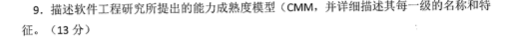

###### 解答

[参考](https://www.cnblogs.com/imyalost/p/7859824.html)

一级为**初始级(Initial)**：无序的 甚至混乱的

二级为**可重复级(Repeatable)**：有纪律的

三级为**已定义级(Defined)**：标准的 一致的模型

四级为**已管理级(Managed)**：度量的和可预测的

五级为**优化级(Optimized)**：预防过程和产品缺陷，关注过程持续改进

#### 软件配置管理 + 变更源


###### 解答：

软件配置管理：用技术和管理的指导和监督方法，来标识和说明配置项的功能和物理特征，控制对这些特征的变更，记录和报告变更处理及其实现，并验证与需求规格的一致性 

###### :cn: 四个基本变更源

* 新的业务或市场条件
* 新的客户需求
* 企业改组或扩大/缩小规模
* 预算或进度安排的限制

####解释几种测试方法 

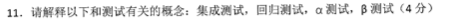

###### 解答


## 2013

### 解答

#### :x: 有理数类的实现与测试 (JUnit)

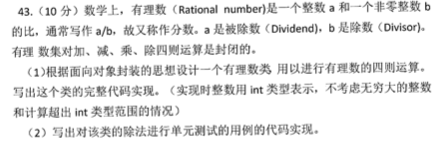

```java
public class Rational{
    private int i;
    private int j;
    public Rational(){
        this.i = 1;
        this.j = 1;
    }
    public Rational(int i,int j){
       	this.i = i;
      	this.j = j; 
    }
    public void setRational(int i,int j){
        this.i = i;
        this.j = j;
	}
    public int getI(){
        return this.i;
    }
    public int getJ(){
        return this.j;
    }
    public Rational add(Rational r){
        Rational sum = new Rational();
        sum.setRational((int)(i*r.getJ() + j*r.getI()), (int)this.j*r.getJ())
    }
    public Rational substract(Rational r){
        pass;
    }
    public Rational Multiple(Rational r){
        pass;
    }
    public Rational Division(Rational r){
        pass;
    }
    public void toString(){
        return i+"/"+j;
    }
}

/*
测试代码
*/
public class RationalTest(){
    public static void main(String []args){
        Scanner scanner = new Scanner(System.in);
        Scanner in=new Scanner(System.in); System.out.println("please enter two number");
        Rational a=new Rational(in.nextInt(),in.nextInt());
        Scanner in=new Scanner(System.in); System.out.println("please enter two number");
        Rational a=new Rational(in.nextInt(),in.nextInt());
        Rational result = a.Division(b);
        if(result.getI()!=a.getI()*b.getJ()|| result.getJ()!=a.getJ()*b.getI())){
            System.out.println("error");
        }
    } 
}
```

使用JUnit设计测试代码

```java
//使用JUnit 仿照P294
@RunWith (Value = Parameterized.Class)
public class RationalTester{
    private Rational a;
    private Rational b;
    private Rational result;
    
    @Parameters
    public static Collection<Rational> getTestParameters(){
        return Array.asList(new Rational[][]{
            // a , b 
            {new Rational(1,2),new Rational(3,4),new Rational(4,6)},//测试用例1 , 1/2 / 3/4  = 4/6
            {new Rational(),new Rational()},//
            {new Rational(),new Rational()},//
            {new Rational(),new Rational()},//
        })
    }
    public ParameterizedTest(Rational a, Rationial b,Rational result){
        this.a = a;
        this.b = b;
        this.result = result;
    }
    @Test
    public void testRational(){
        assertEquals(result,a.Division(b));
    }
}
//此外，还需要重写一下 Rational 的 equals() 方法
bool equals(Rational b){
    return this.getI()==b.getI() && this.getJ()==b.getJ();
}
```

#### 正方形类-长方形


###### 解答

1. 违反LSP，用组合代替继承，见期末B卷
2. 不符合单一职责原则：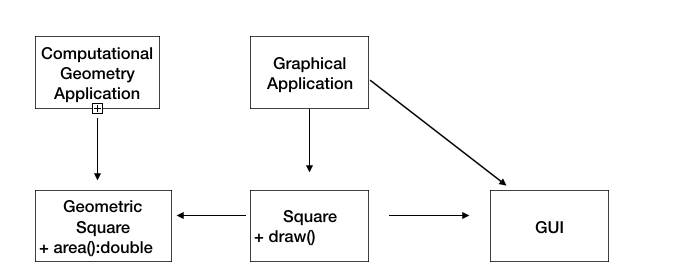

## 2014

### 解答题

#### 描述软件体系结构分层风格（略）

#### 建立分析类图---创建路单

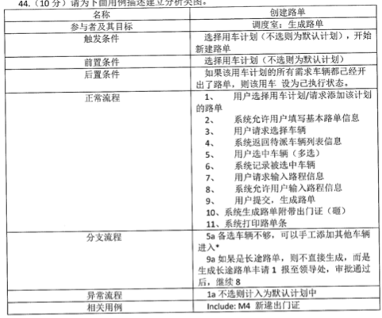

###### 解答：来自学长（P100）

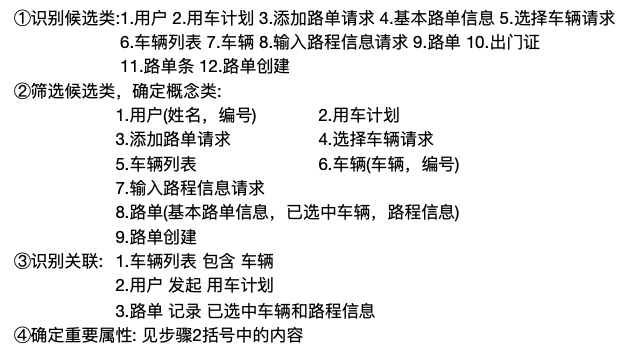

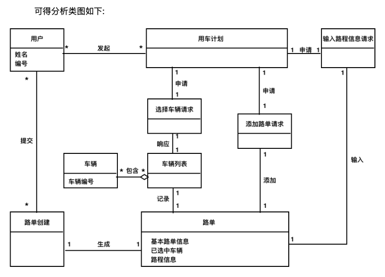

#### 分析代码质量不高的地方并改进 -- Department类

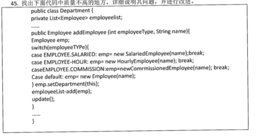

解答：

代码问题：违反开闭原则；代码灵活性和可扩展性较低；

###### :cn:<简单工厂>改进

```java
//可以将判断语句下沉到工厂类中
public class Department{
    private List<Employee> emplyeeList;
    public Department(){
    }
    public Emplyee addEmployee(int employeeType,String name){
        SimpleFactory factory = new simpleFactory();
        Employee employee = factory.createEmployee(employeeType ,name);
        employee.setDepartment(this);
        employeeList.add(employee);
        return employee;
    }
}
public class simpleFactory{
    public Employee createEmployee(int employeeType,String name){
       	Employee employee;
        switch(employeeType){
            case EMPLOYEE.SALARIED :employee = new SalariedEmployee(name);break;
            case EMPLOYEE-HOUR: emp= new HourlyEmployee(name); break;
			case EMPLOYEE.COMMISSION:emp=new CommissionedEmployee(name); break; 
            default: emp= new Employee(name);
        }
        return employee;
    }
}
```

```java
//还可以将判断上抛
//谁调用 addEmployee() 谁判断
public interface Employee{}
public class SalariedEmployee implements Employee{
    
}
public class HourlyEmployee implements Employee{}
public class CommissionedEmployee implements Employee{}

public class Department{
    private List<Employee>emplyeeList;
    public Department(){
    }
    public Emplyee addEmployee(Employee employee){
        employee.setDepartment(this);
        employeeList.add(employee);
        return employee;
    }
}
```


## 2015

### 名词解释：

1. 软件工程
2. 软件需求

### 解答题

#### 图示面向对象体系结构风格，优缺点（略）

#### 建立分析类图 -- 自驾游路线设计

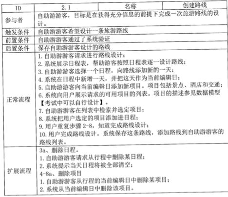···

###### 解答 ： 见「软件工程强化与冲刺」

#### 代码质量不高的地方并改进 -- init() 方法

```java
class A{
    private:
    	FinancialReport fr;
    	WeatherData wd;
    	int totalCount;
    public:
    	A();
    	void init(){
            //
            fr = new FinalcialReport();
            fr.setRatio(5);
            fr.setYear("2010");
            
            //
            w = new WeatherData();
            w.setCity("NanJing");
            w.setCode("210093");
            
            //
            totalCount = 0;
        }
}
```

###### 解答：

时间内聚

###### 改进1: 拆分类

```java
class FinalcialReport{
    private:
    	int ratio;
    	String year
    public:
    	void setRatio(int ratio){
            this->ratio = ratio;
        }
    	void setYear(String year){
            this->year = year;
        }
    	void init(){
            this->setRatio(5);
            this->setYear("2010");
        }
}
class WeatherData{
    private:
    	String city;
    	String code;
    public:
    	int setCity(String city){
            this->city = city;
        }
    `	int setCode(String code){
    		this->code = code;
    	}
    	void init(){
            this->setCity("NanJing");
            this->setCode("210093");
        }
}
class A{
    private:
    	FinancialReport fr;
    	WeatherData wd;
    	int totalCount;
    public:
    	void init(){
            this->totalCount = 0;
            fr.init();
            wd.init();
        }
}
```

###### 改进2: 拆分方法

```java
class A{
    private:
    	FinancialReport fr;
    	WeatherData wd;
    	int totalCount;
    public:
    	A();
    	void initFinancialReport(){
            fr = new FinalcialReport();
            fr.setRatio(5);
            fr.setYear("2010");
        };
    	void initWeatherData(){
            w = new WeatherData();
            w.setCity("NanJing");
            w.setCode("210093");
        }
    	void initTotalCount(){
            totalCount = 0;
        }
}
```

#### 修改不足 -- 多个compare

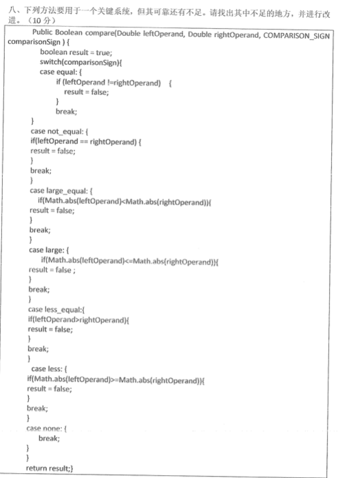

###### 解答：用策略模式

```java
interface Compare{
    public boolean compare(Double leftOperand, Double rightOperand);
}
public class Equal implements Compare{
    public boolean compare(Double leftOperand, Double rightOperand){
        if(leftOperand != rightOperand){
            return false;
        }
        return true;
    }
}
public class NotEqual implements Compare{
    public boolean compare(Double leftOperand, Double rightOperand){
        ...
    }
}
public class LargeEqual implements Compare{
    public boolean compare(Double leftOperand, Double rightOperand){
        ...
    }
}
public class Large implements Compare{
    public boolean compare(Double leftOperand, Double rightOperand){
        ...
    }
}
public class LessEqual implements Compare{
    public boolean compare(Double leftOperand, Double rightOperand){
        ...
    }
}
public class Less implements Compare{
    public boolean compare(Double leftOperand, Double rightOperand){
        ...
    }
}

public class Context{
    private Compare compare;
    public void setCompare(Compare com){
        this.compare = com;
    }
    boolean getCompareRes(Double leftOperand,Double rightOperand){
        return compare.compare(leftOperand,rightOperand);
    }
}
public class Client{
    Equal equal = new Equal();
    NotEqual not_equal = new NotEqual();
    LargeEqual large_equal = new LargeEqual();
    Large large = new Large();
    LessEqual less_equal = LessEqual();
    Less less = new Less();
    
    Context context = new Context();
    context.setCompare(equal);
    //context.setCompare(not_equal);
    //context.setCompare(large_equal);
    // ... 
    
    boolean Test(){
    	return context.getCompareRes(leftOperand,rightOperand);  
    }
}
```

类图：


## 2016

#### 质量保障的三种手段

评审，测试，质量度量

#### 判断需求类型

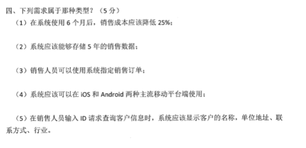

###### 解答：

P76

1. 功能
2. 性能
3. 功能
4. 约束
5. 功能

#### ATM取款用例

###### 解答：

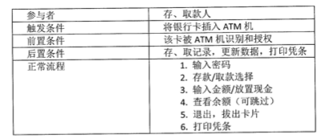

上面的答案过于简单

###### 解答二


#### 违反原则-改进代码 --- employee类


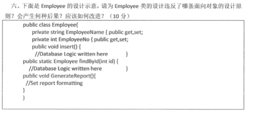

###### 解答

违反单一职责原则，内聚性不够，影响修改和扩展时的灵活性。

将insert() , findById(), GenerateReport()分别放在单独的类中


#### 用契约式/防御式 改写代码 --- Deposit类

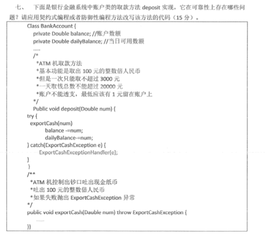

###### 解答

```java
//断言式
public void deposit(Double num){
    //前置条件
    assert (num<= 3000 && num%100==0):("error");
    try{
        ..
    }catch{
        ..
    }
   	//后置条件
    assert (dailyBalance >= 0&&balance >= 1):("error");
}
```


## 2017

#### 名词解释

##### 软件工程

##### 持续集成

#### 需求题

##### 需求的三个层次

##### 从三个层次出发，描述图书管理系统中的需求

#### 体系结构 -- 大小写转换

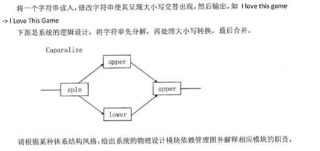

###### 解答： P150

主程序/子程序风格

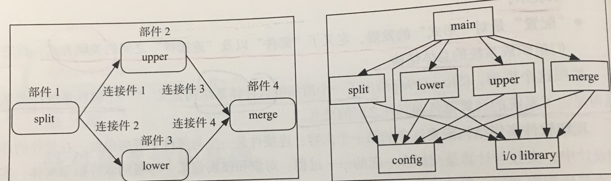

#### 类的职责与封装 -- person类

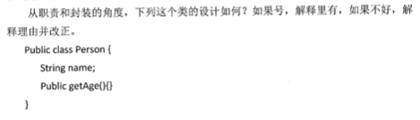

###### 解答

总感觉者答案写的有点牵强

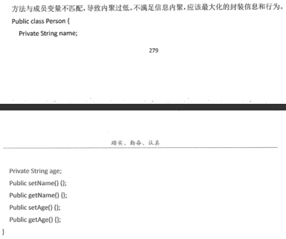

#### 面向对象  -- 计算个人所得税 

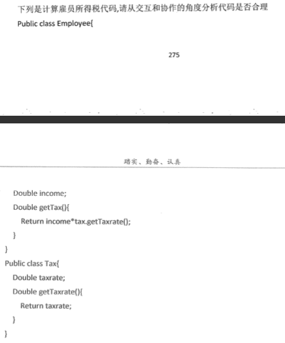

###### 解答：违反迪米特

getTex()逻辑上并不属于Employee的方法，违反迪米特法则，并造成隐式访问

```java
public class Employee{
    private Double income;
    public Double getIncome(){
        return income;
    }
}
public class Tax{
    private Double taxRate;
    private Employee employee;
    public Double getTaxRate(){
        return raxRate;
    }
    public Double getTax(){
        Employee employee = new Employee();
        return empolyee.getIncome*taxRate;
    }
}
```

```java
public class Employee{
    private Double income;
    public Double getIncome(){
        return income;
    }
    public getTax(){
        Tax tax = new Tax();
        return Tax.calculateTax(income);
    }
}
public class Tax{
    private Double taxRate;
    public Double getTaxRate(){
        return raxRate;
    }
    public Double calculateTax(Double income){
        return income * taxTate;
    }
}
```

:x:感觉上面两个代码都不太好，怎么改进？

#### 面向对象 -- 网络选课系统

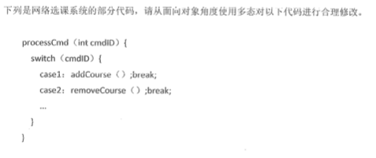

###### 解答

```java
//将判断上抛
interface Command{
    public void handle(){}
}
public class addCourse{
    public void handle(){
        
    }
}
public class removeCourse{
    public void handle(){}
}
public Test{
    processCmd(Command cmd){
        cmd.handle();
    }
}
```

```java
//将判断下沉
//利用工厂模式，将判断放到工厂中

```


#### 消除代码重复 -- getTotalSum

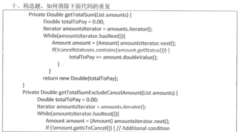

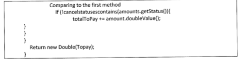

###### 解答1

```java
//设置标志位来判断需要输出哪个结果
private Double getSum(List amounts,int flag){
    Double totalToPay = 0.00;
    Double totalToPayExcludeCancel = 0.00;
    Iterator amountIterator = amounts.iterator();
    while(amountIterator.hasNext()){
        Amount amount = (Amount)amountIterator.next();
        if(!cancelStatuses.contains(amount.getStatus)){
            totalToPay += amount.doubleValue();
            if(!amount.getIsToCancel()){
                totalToPayExcludeCancel += amount.doubleValue();
            }
        }
    }
    if(flag)return Double(totalToPay);
    else return Double(totalToPayExcludeCancel);
}
```


###### 解答2

下面的答案写的啥玩意，看不懂

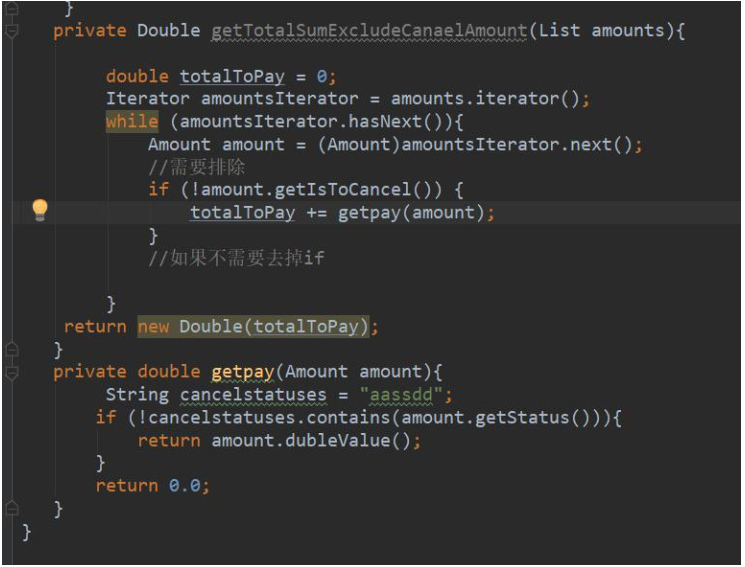

#### 测试题

##### 什么是黑盒测试

##### 黑盒测试的方法

等价类划分，边界值分析，决策表，状态转换


## 2018

#### 问答题

##### 科学与工程的区别

##### 集成测试，单元测试，集成测试与单元测试用例的区别

##### 功能性需求与非功能性需求

##### 四个软件体系结构视角

##### 质量模型的可用性

#### :x: 房屋评估系统的合理性

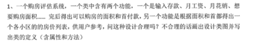

###### 解答


#### :x:计算税费

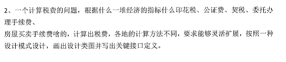

###### 解答


## 2013备用卷

#### 面向对象 -- 计算点之间的距离与方向

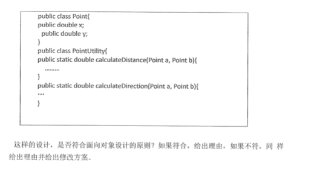

###### 解答：没有集中信息与行为

不符合，没有集中信息与行为，内聚性低 P248

```java
public class Point{
    private double x;
    private double y;
    public double calculateDistance(Point b){}
    public double calculateDirection(Point c){}
}
```

#### :x:智能家居系统

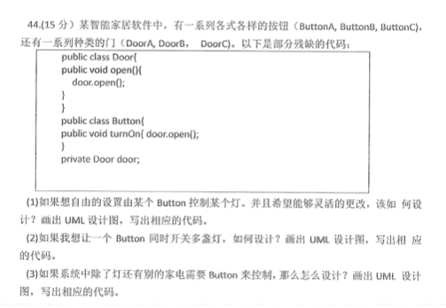

###### 解答

不是控制「门」吗，怎么到了题目成了控制灯？？？

1. 每个Button实例控制一盏门，抽象Door，使得Door可灵活更改。二者直接依赖关系

```java 
public class Button{
    Door door;
    public Button(Door d){
        door = d;
    }
    public void turnON(){
        door.open();
    }
    public void turnOFF(){
        door.clost();
    }
}
public interface Door{
    public void open();
    public void close();
}
public class DoorA implements Door{
    
}
public class DoorB implements Door{
    
}
public class DoorC implements Door{
    
}
public class TestClient{
    public static void main(string []args){
        Door doora = new DoorA();
        Button buttona = new Button(doora);
        buttona.turnON();
    }
}
```

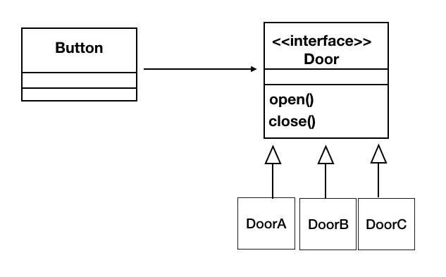


2. 一个Button控制多个灯

```java
import java.util.ArrayList;
public class Button{
    private ArrayList<Door> doorList = new ArrayList<>();
    public Button(ArrayList<List> doorlist{
        doorList = doorlist;
    }
    public void turnON(){
        for(door:doorList){
            door.open
        }
    }
    public void turnOFF(){
        for(door:door:List){
            door.close();
        }
    }
    public void addDoor(Door d){
        doorList.add(d);
    }
    public boolean deleteDoor(Door d){
        
    }
}
public interface Door{
    public void open();
    public void close();
}
public class DoorA implements Door{
    
}
public class DoorB implements Door{
    
}
public class DoorC implements Door{
    
}
```

3. 需要控制多种设备，把包括灯在内的所有设备抽象为Device接口，Button只持有Device接口，不区分具体是什么设备

```java
import java.uitl.LinkedList;
public class Button{
    LinkedList<Device> deviceList = new LinkedList<>();
    public Button(LinkedList devicelist){
        deviceList = deviceList;
    }
    public void turnON(){
        door.open();
    }
    public void turnOFF(){
        door.clost();
    }
    public void addDevice(Device d){
        deviceList.add(d);
    }
    public boolean deleteDevice(Device d){
        deviceList.remove(d);
    }
}
public interface Device{
    public void open();
    public void close();
}
public class Door implements Device{
    public Door(){
        super();
    }
}
public class DoorA extends Door{
    
}
public class DoorB extends Door{
    
}
public class DoorC extends Door{
    
}
public class TV implements Device{
    
}
public class AirConditioner implenents Device{
    
}
```

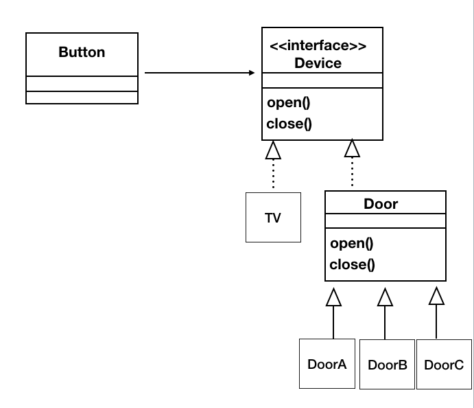


## 2019

#### 简答题

##### 生命周期模型 

##### 功能需求与非功能需求 

##### 软件开发不同阶段的质量保证手段 

##### 体系结构的四个视角  

##### 黑盒白盒差异


#### 迪米特法则 --- sales类

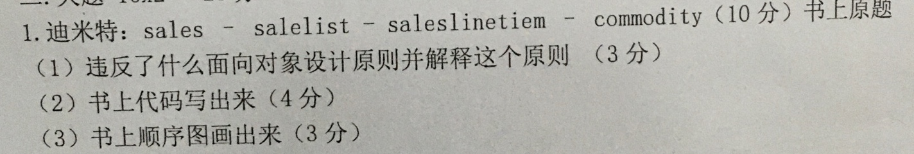

###### 解答： P233

#### 设计模式 ---飞机类

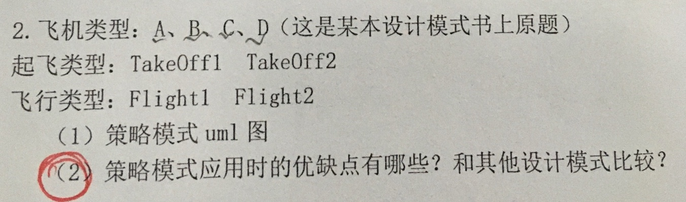

###### 解答

UML图类似于 P268

:cn:策略模式的优缺点：

1. 优点：
   * 避免多重选择语句
   * 可以动态选择不同的策略
2. 缺点：
   * 用户必须事先知道所有的策略
   * 会创建出较多的对象


# 附录 -- 遗留未解决的问题

#### 2017年个人所得税问题


###### 解答：违反迪米特

getTex()逻辑上并不属于Employee的方法，违反迪米特法则，并造成隐式访问

```java
public class Employee{
    private Double income;
    public Double getIncome(){
        return income;
    }
}
public class Tax{
    private Double taxRate;
    private Employee employee;
    public Double getTaxRate(){
        return raxRate;
    }
    public Double getTax(){
        Employee employee = new Employee();
        return empolyee.getIncome*taxRate;
    }
}
```

```java
public class Employee{
    private Double income;
    public Double getIncome(){
        return income;
    }
    public getTax(){
        Tax tax = new Tax();
        return Tax.calculateTax(income);
    }
}
public class Tax{
    private Double taxRate;
    public Double getTaxRate(){
        return raxRate;
    }
    public Double calculateTax(Double income){
        return income * taxTate;
    }
}
```

:x:感觉上面两个代码都不太好，怎么改进？

:x: 怎么修改更合理，Employee和Tax类应该是怎样的关系？？

:white_check_mark: 应用策略模式

```java
public class Employee{
    private Double income;
    private Tax tax;		//雇员持有一个策略接口
    public Double getIncome(){
        return income;
    }
    public void setTax(ConcreteTax cTax){//设置策略
        tax = cTax;
    }
    public Double getTax(){//调用策略的计算
        return tax.calculateTax(income);
    }
}
public interface Tax{ //策略接口
    public void calculateTax(int income);
}
public class ConcreteTax implements Tax{ // 具体策略
    private Double taxRate;
    public void calculateTax(int income){
        return income*taxRate;
    }
}
public class Client{
    private Employee employee;
    ConcreteTax cTax = ConcreteTex();
    employee.setTax(cTax);//为雇员设置策略
    System.out.print(employee.getTax());//计算结果
}
```

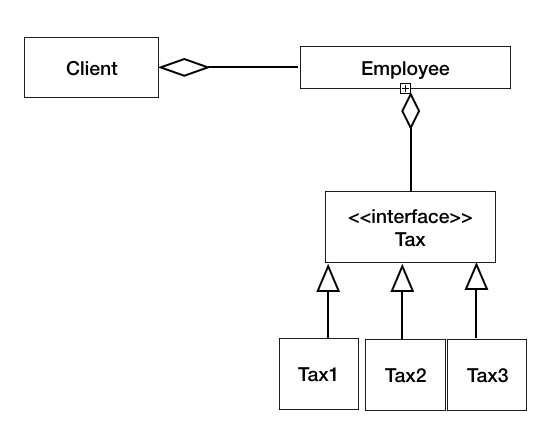

#### 几个软件测试题代码


###### 解答

参考答案（不太靠谱）


:x:怎么设计测试用例和测试代码

#### 2013年备用 按钮-灯泡-门


:x:这是个啥，这几个乱七八糟的类怎么协作？？

#### 2018房屋评估系统


:x:怎么设计类，类之间的关系应该是怎么样的？？

#### 2018 计算税费问题


这是我画的类图

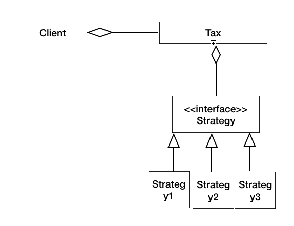

:x: 印花税，公正税，契税，委托办理手续费，房屋买卖手续费。。 这些应该作为哪个类的属性？？

