[TOC]

# 第一、二章

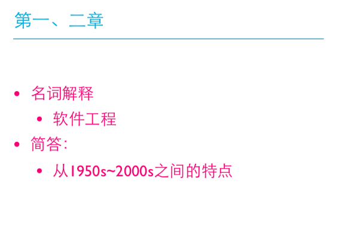

* 软件工程：
  * 用系统的、规范的、可量化的方法开发、测试和维护软件
  * 对上述活动的研究
* 特点：
  * 50：科学计算，以机器为中心进行编程，像生产硬件一样生产软件
  * 60：业务应用（批量数据处理和事务计算）；软件不同于硬件，用软件工艺方法生产软件
  * 70：结构化方法，瀑布模型，强调规则和纪律
  * 80：追求生产力最大化；现代结构化方法/面向对象编程广泛应用，重视过程的作用
  * 90：企业为中心的大规模软件系统开发，追求快速开发、可变更性和用户价值；web应用出现
  * 00：大规模web应用，大量面向大众的web产品；最求和快速开发、可变更性和用户价值

# 第四章 项目启动

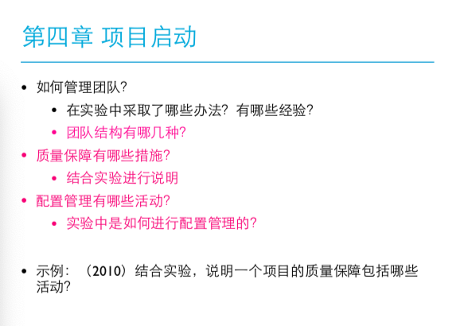

* 管理团队
  * 建立团队章程
  * 和谐沟通
  * 持续成功
  * 避免团队杀手
* 团队结构
  * 主程序员团队
  * 民主团队
  * 开发团队
* 质量保障的措施
  * 需求开发：需求评审、需求度量
  * 体系结构设计：体系结构评审、集成测试（持续集成）
  * 详细设计：详细设计评审、设计度量集成测试（持续集成）
  * 软件构造：代码评审、代码度量、测试（测试驱动、持续集成）
  * 测试：软件测试、测试度量
* 配置管理的活动：
  * 标识配置项
  * 版本管理
  * 变更控制
  * 配置审计
  * 状态报告
  * 软件发布管理

# 第五章 

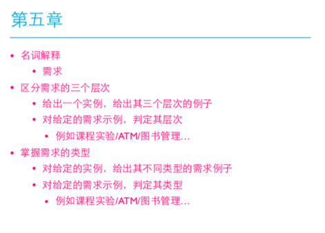

# 第六章

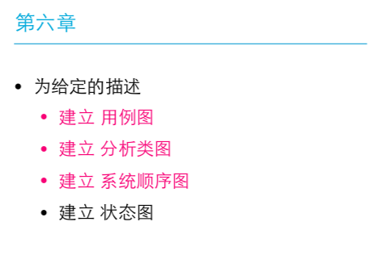

* 用例图
  * 明确目标
  * 寻找参与者
  * 寻找用例
  * 细化用例
* 分析类图
  * 识别候选类
  * 筛选候选类、确定概念类
  * 识别关联
  * 确定重要属性

# 第七章

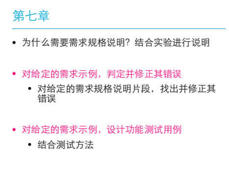

* 需求规格说明：
  * 简介
  * 精确✨
  * 易读
  * 易修改

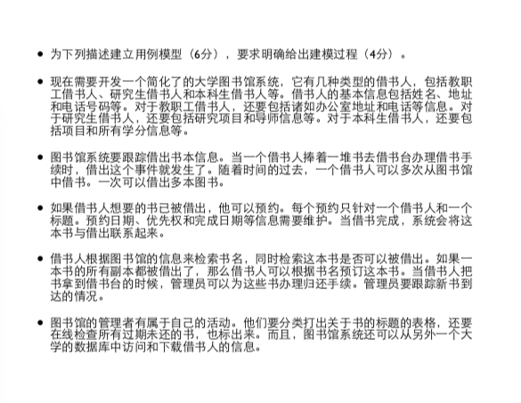

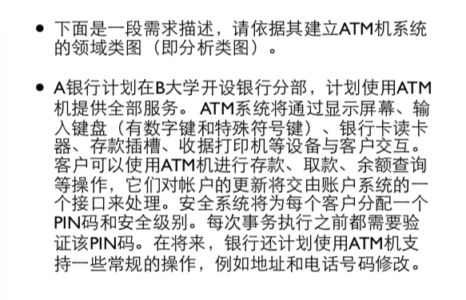

# 第八章

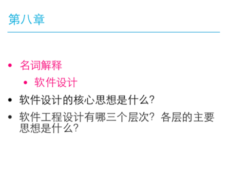

* 软件设计：软件设计是关于软件对象的设计，是⼀一种设计活动，具有设计的普遍性。软件设计既指软件对象实现的规格说明，包含软件设计和软件原型，也指产⽣生这个规格说明的 过程。即软件设计⼯工程师以对象的⽬目标和⽤用户的需求为指引，在⼀一定的客观约束条件下，通过分析、 研究、建模等活动进⾏行行软件设计。
* 软件设计的核心思想：
  * 抽象：纵向上聚焦各子系统之间的接口
  * 分解：横向上将系统分割为几个相对简单的子系统以及各子系统之间的关系
* 三个层次：
  * 高层：基于反映软件高层抽象的结构层次，描述系统的高层结构、关注点和设计决策
  * 中层：更加关注组成构建的模块划分、导入导出、过程之间的调用关系或类之间的协作
  * 底层：深入模块和类的内部，关注具体的数据结构、算法、类型、语句和控制结构等。

# 第九章

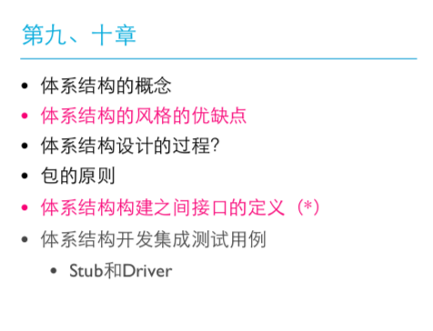

# 第十一章

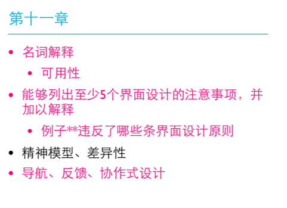

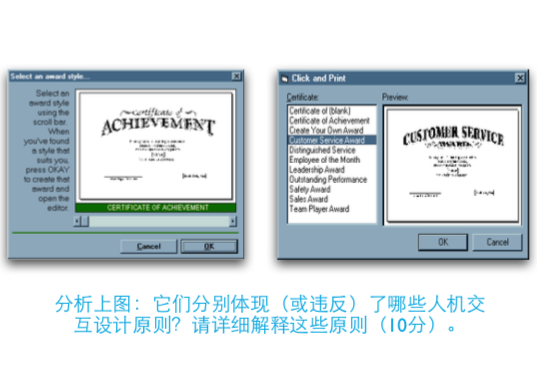

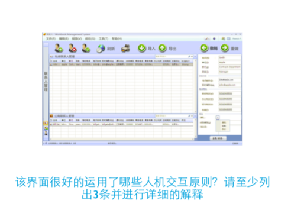

# 第十二章

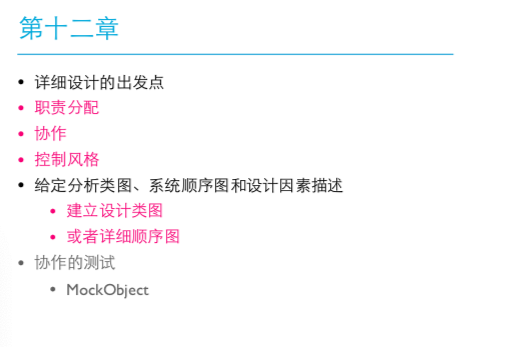

# 第十三章

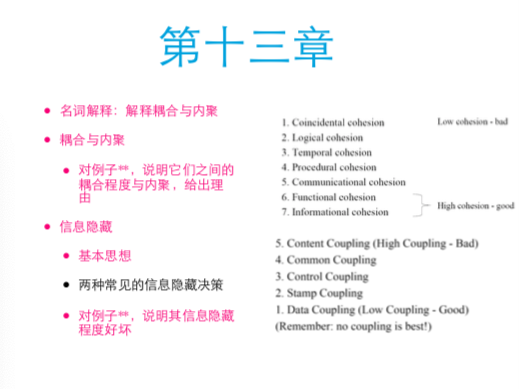第十二章

# 第十四章

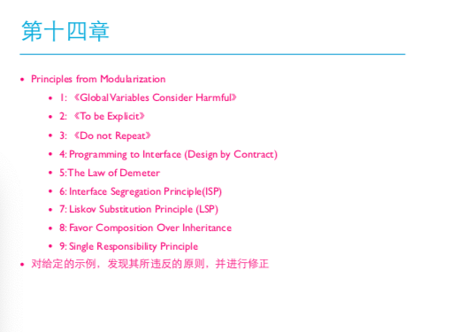第十二章第十三章

# 第十五章

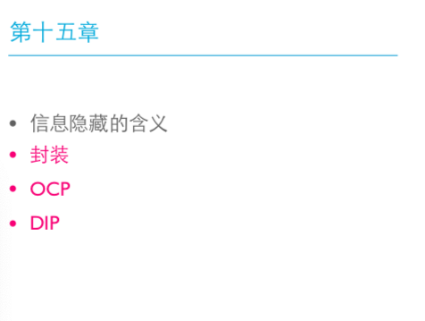

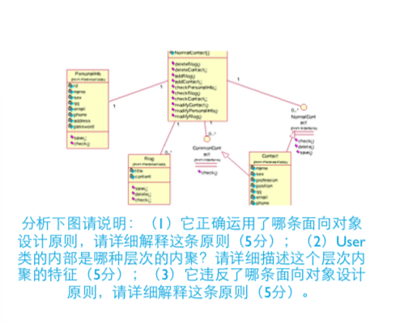

# 第十六章

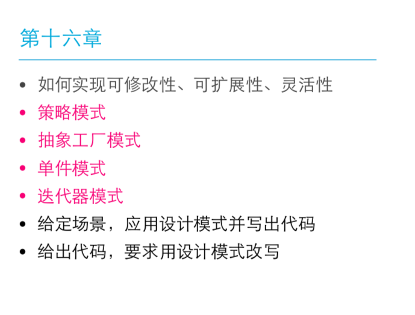

# 第十七&十八章

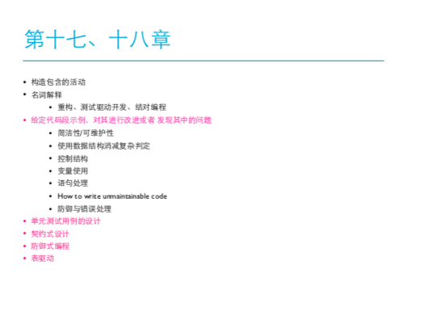

# 第十九章

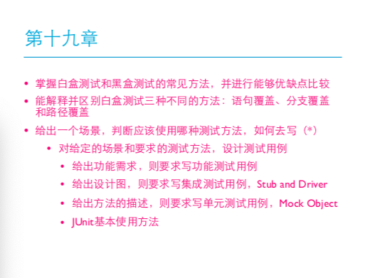

# 第二十&二十章

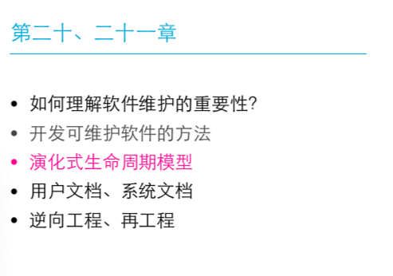

# 第二十二&二十三章

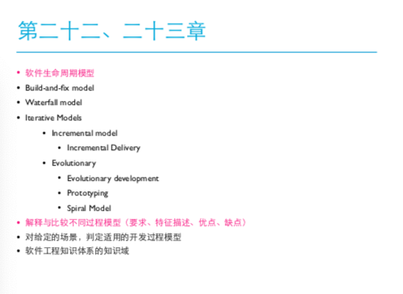

# 附录

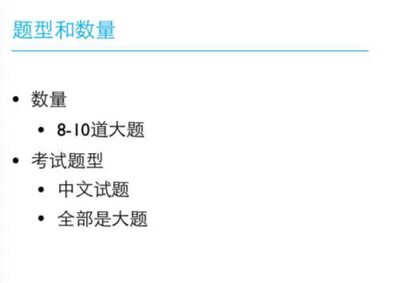