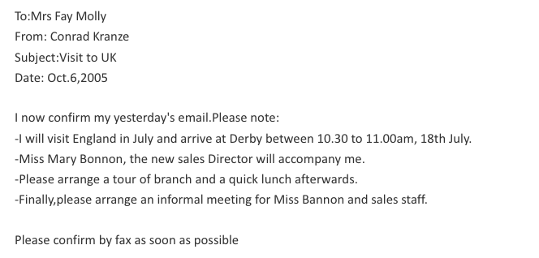
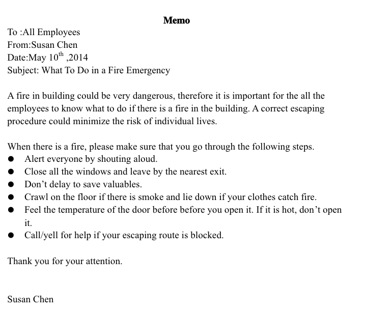

[TOC]

# 小作文

## 客套话

### 亲爱的

1. Dear Sir or Madam,
2. My Dear Friend,
3. Dear boys and girls,

### 我是谁

1. So I, on behalf of the Office of Student Affairs , sincerely extend you an invitation to this ceremony.

### 什么事

1. I am writing to inform you that there will be a charity sale ... 
2. It is a great honor to inform you that  ... 
3. I am writing to express my humble opinions about ... 

### 要干啥

1. 
2. this sale is going to be held to in the auditorium for sake of kids on the verge of dropping out..
3. 

### 感谢你

1. it would be much appreciated if you could please send back the reply slip before June 21th to inform us of your attendance.
2. I really appreciate everything you have done for me.
3. I am writing to **express my heartfelt gratitude** to you considerate reception . 
4. thank your for taking the time to read this letter. 
5. **With the sincere appreciation for your dedication** to our project ,  , I...  (dedication 奉献)

### 很荣幸

1. we will be greatly honored if you could be present at the ....
2. it is my great honor to ...
3. I am honored to ... 

### 快回信

1. I look forward to your reply
2. send me a list beforehand of .. 
3. If detailed information is required , please reach me at 123456.
4. Your help is greatly appreciated. 
5. hope to get your early reply
6. **It is hoped that my reply will be of help and please email me if you have any further questions**
7. if detailed information is required , please reach me at 123456.

### 有附件📎

1. the schedule of the ceremony is attached for your reference.

### 再感谢

1. thank you for your invitation and look forward to meeting you.
2. Thank you once again for your kind invitation.h
3. Thank you for your taking the time to read this letter.
4. your help is greatly appreciated.
5. It will be grateful if you could ...

### 祝福语

1. please give my best regards to your family.

## 1. 书信

### 格式

### 道歉信

1. please accept my **sincere** apology for not being able to ... , since ...
2. Unfortunately ... 
3. do you mind if I reschedule our appointment for next month?
4. please let me know which day and time is most convenience for you 
5. I hope that this does not cause you any inconcenience.
6. 

### 感谢信

1. I just want to write a letter to thank you for your warm reception.
2. I am writing to express my heartfelt/sincere gratitude to your considerate reception .. 
3. 

### 推荐信

### 请求信（公务信函）

## 2. 告示（Notice）

### 第一段（开门见山）

##### To... , I am writing to ...

to ensure that students from overseas have a better knowledge of our library service , I am writing to inform you of some relevant information **with regard of** (关于)our university library.

##### Please pay attention to this announcement

### 第二段

### 第三段:( 联系方式)

1. please feel free to contact us if you need any help via xxxxatxxxx.edu.cn.
2. If you need more information / further information , please contact us at xxx

## 3. memo

### 格式：

To: Tom/ all facuty/

From: John , manager

Date: September ,1st , 2019

Subject: 

### 第一段

#### 🌰

## 4. report

