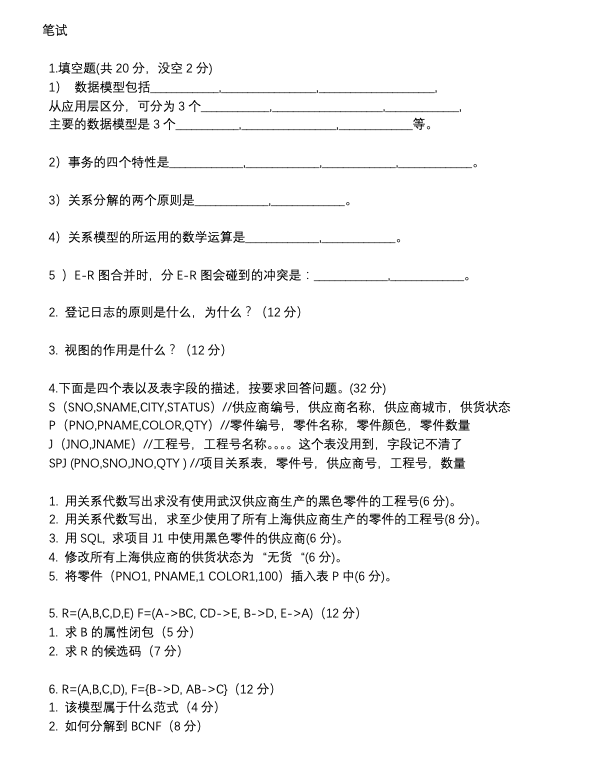
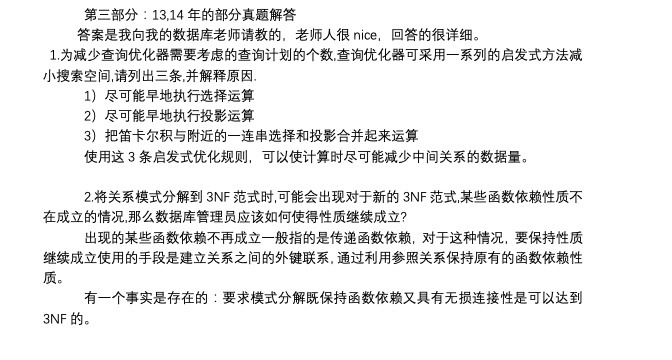

[TOC]


# 历年考题

两个字符串的最长公共子序列


王珊的数据库看第二章关系代数、第三章 SQL，然后看范式和锁那块就行，重 点是数据库开发技术，考的就是刘嘉老师的 PPT，PPT 其实相当于提纲，他有个整理的资料 的，把那个背熟练即可!最好自己搜下相关的，今年准备得真的很不充分了，没想到考了 2015 数据库开发技术的期末题，当时一看那个 SQL 就不像刘嘉老师的出题风格啊，老师都是偏 oracle 的，看到题目都伤心死了，还有很多自认为不是重点的知识点也没背...所以学弟学妹 们一定不能放过每一个点。


3 月 17 号下午进行数据库笔试，也过了一个星期了快，大致说下。填空题 20 个空，每空一 分，这就要求大家还是把推荐书目概念看下，说不定明年考的就是概念了。接着是两个简答 题，每题 12 分，问数据库登记日志的原则，为什么以及视图的作用。再接着是写 sql 语句 还有关系代数，比较常规的题目，包括数据库的增删改查。还有就是给你一个关系，求属性 闭包以及候选码。最后一题是问一个关系属于第几范式，怎么分解到 BCNF。


去年是名词解释、查询优化规则、SQL 与索引、数据库设计与 模式、属性闭包、关系代数证明(无损分解证明)。今年就是名词解释、数据结构(哪些数 据结构适用内存哪些适用磁盘，区别标准是什么，举例)、分解模式要有哪些性质(无损分 解)、如何建好的索引、写 SQL(两个，一个和去年一样的)、分解模式到 3NF、最后来了一 个 B+树，初试的时候第一个题就被 B 树虐了一回这回又被 B+树虐爆了。真是伤心。所以好 好复习才是王道。不要专门准备某一章，说不定到明年又变了，所以有时间的时候复习仔细 点，没时间再去赌重点。个人感觉笔试做得一般，毕竟中间写语句和分解到 3NF 都作对了 吧。自己心里是这么想的。= =


 sql语句一定要熟练运用，能够用sql语句进行求最值操作以及求平均值操作，基本是考察

* sql语句嵌套，group by操作，比较常规。
* 另外三范式也要理解，其他的把课件上的内容记下来就差不多了，不会很难。
* 值得注目的是数据库课件内容特别重要，因为题目本身是很难的，自己编答案是编不出来的，一定要把刘嘉老师的课件那几个重要（索引、sql优化等）的点背下来。
* 常见的考点有：事务和程序区别、
* 完整性约束、
* 排它锁共享锁死锁活锁、
* 范式概念以及作用、
* 数据库设计步骤、
* SQL与NOSQL的区别、
* SQL优化、
* 大数据与BI区别


* 下午：笔试数据库，满分 100 分。
  具体问题记不清了，说下题型：
  1. 名词解释（5 个，一个 6 分，总共 30 分），有范式的概念等
  2. SQL 编程（10 个 SQL 语句 1 个 3 分，大的 SQL 语句 1 个 10 分，总共 40 分），可以用任意SQL语句写，但是要注明用的是哪种 SQL，我用的是 MySQL,我用的书是《 MySQL 必知必会》，这是本快速入门的书，还有就是教材《数据库系统概论》。但是对考试的 SQL 编程来说还是比较困难。以前考过计算中位数的问题，详见以前的复试贴，今年还是考了计算中位数的问题，而MySQL里是没有直接计算中位数的函数，总之都不是基本的 SQL。以前的题一定要好好看。
  3. 问答题（3 个，1 个 10 分，总共 30 分）


数据库考试，难度较大，现在基本上都出很多软院《数据库开发技术》的知识(软院数据库有两门)，找到PPT研究研究


## 19年

Part 1：数据库笔试

依旧是刘嘉老师的出题风格，整张卷子分为三个板块，**数据库基础简答**（虽然一点都不基础），**数据库SQL编写**，**高性能数据库**。

基础简答包括（序号与题号无关）：

​					1，数据库空值的含义，不同数据库是如何处理空值的。

```
P119，空值就是“不知道”，“不存在”或“无意义“的值
```

​                     2，请简述DBMS处理SQL语句的流程（原理）。

```
查询处理的四个阶段：
1. 查询分析：词法分析，语法分析
2. 查询检查：有效性检查，视图转换，安全性检查，完整性检查  ---> 语法分析树
3. 查询优化：代数优化，物理优化  依据(基于规则，基于代价，基于语义)
4. 查询执行：代码生成 执行方法(自顶向下，自底向上)
```

数据库SQL编写 共两个大题。每题3个小问，一个问6分。（**写出的SQL语句要注明用的是Oracle还是Mysql，用sqlserver 的最好学一下前两者之一**）

​                     1.商店，货物，售货员，流水账单四个表。具体属性不能完全记得了，大致如下：

​                      store（store_id,floor,store_name,etc.）id当然主键，floor为楼层（无用信息）

​                      commodity(comm_id,comm_price,comm.name,etc.)

​                      saler(saler_id,store_id,saler_name,saler_name,etc.) store_id表示这个售货员在这家店干活

​                      bill(bill_id,saler_id,store_id,total_price,quantity,comm_id) 最重要的一个表，saler_id表示这个订单

​                      是这个员工卖的，买的是comm_id这件商品，总共卖了quantity件，总价是total_price。

​                    问题：1）插入记录，其中total_price是不告诉你值，要求你在插入语句中顺便计算出来，怎么计算呢，按照quantity和comm_id来计算。请完成这样的一条插入。

```
# mysql
insert 
```


​                        2）计算在2018-11-11日，商场中单日营业额（流水）最高的店，检索出店名等和店有关的信息，以及销售总额

```
# mysql
select store_id,floor,store_name
from store
where store_id in (
	select store_id, SUM(total_price) as sum
	from bill
	where date = 'xxx'
	group by store_id
	
	)
```


​                        3）忘了，回头想起来补上

​                 

2.学生选课 学生（id啊，name 啊，grade（年级）啊，等等）

​                            课程（id，课程名 name，开课年份，开课的学期（只能是1，2），teacher_id即交这门课的老师id，                              课程学分啊等等）

​                            老师（id，name，title（职称）等等）好像没用到这个表，记不清了

​                            选课（id,课程id，学生id，该学生这门课的成绩 等等）

​                       1）很简单的一问，几个表联合查询，一个在2019年第一学期大三学生选的什么课。总之一个select搞定

```

```

​                       2）创建一个视图（娘的，我之前看王道经验帖都是说视图触发器不可能考，/拍桌），视图很简单的一个查询，                        这题考的目的是看看视图语法你会不会（个人觉得）

```
create view newView(xxx,xxx)
as 
select xxxx
from xxxx
where xxxx
```

​                       3）好了，这题是触发器。over

```
create trigger
before/after insert on SC
reference 
	oldrow as oldTuple,
	newrow as newTuple
for each row
when newTuple.grade < 60
insert into SC ( xx,xx)
values(oldTuple.Sno,xx,60)
```

，（小声bb：我不会）。录入成绩时小于60按60算，大于60就不做改动。


高性能数据库：1，简述 查询优化器的工作原理，说一下查询优化器的逻辑是什么。（什么叫 “逻辑是什么” 啊啊啊？？）逻辑我说的时语法语义执行优化

```
工作原理：通过某种代价模型计算出各种查询执行策略的执行代价，然后选取代价最小的执行方案。
```


​         2，B*树是大多数数据库都缺失的一种数据结构，说说 a）B*树的索引结构 b)B*树的适用情况 c）忘了

```
B+ 树的适用范围：
	* 全职匹配
	* 匹配最左前缀
	* 匹配列前缀
	* 匹配范围值
	* 精确匹配某一列并范围匹配另一列
	* 只访问索引的查询
```


​         3，简述数据库的发展流程，为什么会产生这种发展变化。

```
* 人工管理阶段：数据不保存，应用程序管理数据，数据不共享，数据不具有独立性
* 文件系统阶段：数据可以长期保存，由文件系统管理数据，数据共享性差/冗余度大，数据独立性差
* 数据库系统阶段：数据结构化，数据共享性高/冗余度低且易扩充，数据独立性高，数据由数据库管理系统统一管理和控制（数据安全性保护，数据完整性保护，并发控制，数据库恢复）
```


​         4，忘了

* 补充一下复试题哈 第一大题有个 描述数据库语句执行的步骤（先where 再group 再select XXXXXXXXXXXX）

## 2018

#### PartI 数据库名词及概念简答:(5 题，每题 6 分,共 30 分)

* 关系数据库(Relational DataBase)中的关系(Relational) 的具体含义是什么?

```

```


* 对表的外键构建索引的做法非常普遍，已被认为是常识，这样做会避免出现哪些问题? 

```

```


* 什么是分区(Partition) ?根据分区键(Partition Key) 的类型分类，分区有哪几种类型?

```

```


* 数据库的第一范式、第二范式、第三范式各是什么含义?还有哪些范式，请描述其含义? 

```

```


* 什么是索引?很名数据库使用B树索引，这种索引的结构是怎样的?能适合怎样的查询?

```

```


#### Part 2 SQL 编程题:(3 题，前两题每题 15 分，第三题 10 分,共 40 分)

 以下题目请用单独 sQL 语言描述，因为不同数据库的差异，可以使用 Oracle、 MySQL、 sQLServer、DBZPostgresQl,请在你完成的 SQL 中对你使用的数据库进行标识。

* 考虑下面的关系模式、一个雇员可以在多个部门工作，works关系的pic_time字段表明 了一个指定的员工指定的部门工作的时间比率。(15 分)
   Emp (eid, ename, age, salary)
   Works (eid, did, pct time:integer)
   Dept (did, budget, managerid
   用 SQL 写出下列查询:
   1.1) 同时工作于“硬件”和“软件”两个部门的每个雇员的名字和年龄
   1.2) 找出那些工资超过他(或他)所在部门预算 20%的雇员
   1.3) 找出预算最高的前五个部门管理者的 managerids 1.4)如果一个管理者管理多个部门，那么他控制的部门预算就是这些部门的预算的总和，找 出来控制预算超过 50 万的管理者的 managerids。

* 考虑以下数据库设计模式: EMP(EMPNO,ENAME,JOB,HIREDATE,SAL,DEPTNO) DEPT(DEPTNO,DNAME,LOC)
  1. 计算 DNAME = 'Research Institute'的员工工资的“中位数”。所谓中位数是指:组按照大小排 列起来的数据中处于中间位置的数，当有奇数个(如 17 个) 数据时，中间数就是中间那个数(第 9 个);当有偶数个(如 18 个)数据时，中间数就是中间那两 个数的平均值(第 9 个和第 10 个的平均值)
  2. 求第一个员工和最后个员工聘用 (HIREDATE)之间相差的月份数，以及这些月折合的年 数。
  3. 计算 2017 年中周内各日期(星期日、星期...星期六)的次数。(完全用 SQL 完成，可以分 成多步骤完成，包括构建数据表和查询计算结果)
      2.4)计算每个员工的 DEPTNO、ENAME 和 SAL 以及与同一部门(DEPTNO 值相同的)员工之 间的 SAL 的差。该差值在当前员工及同部门内紧随其后的员工之间计算而来，对最聘用的 员工这个差值是 N/S.

* 考虑以下数据库设计模式，orderstatus 是记录订单状态的表，主键是 oid 和 status 的 复合键，订单 包含多种状态，同事某一订单可能会有某一状态多次出现的情况，比如换货的过程。 Customers(cid, cname, city) Orders(oid,cid,date) Orderstatus(oid,status,statusdate) 
  * 请完成查询，列出所有尚未标记为完成状态的订单的以下字段:oid，canme，订单的最后 状态 status
     以及设置状态的时间 statusdate。

#### Partlll 论述题:(3 题，每题 10 分,共 30 分)

* 集中式数据库 和分布式数据库，谁的效率更高?它们各有怎样的特征和应用场景?适合的 不同应用有哪些?

```
* 集中式数据库，查询执行开销主要包括磁盘存取块数（IO代价），处理时间（CPU代价），以及查询的内存开销。
* 分布式数据库还要加上通信代价
```


* 对树状数据的数据构建关系模型，有哪些方式，请举例说明?需要描述表结构设计，同时 需要考虑单父节点和多父节点的多种树状结构类型，针对单父节点的树状结构需要描述至少 三种数据库表结构设计模式，多父节点树状结构至少需要描述一种数据库表结构设计。 3)请描述锁机制和多种锁类型(至少三种)，并举例说明以及描述其应用场景?大部分锁机制都 是数据库配置后自动执行，但请举例描述哪些情况下，必须由程序员利用程序语言控制并发 更新?

提示:树状结构:Adjacency model-邻接模型、物化路径模型、嵌套集合

## 15年

#### 填空题

1. 数据模型包括 **数据结构** ，**数据操作** ，**完整性约束**。从应用层区分可分为 **概念模型**，**逻辑模型**，**物理模型**。主要的数据模型：**层次模型**，**网状模型**，**关系模型**

2. 事务的四个特性：A原子性，C一致性，I隔离型，D持久性

3. 关系分解的两个原则：**无损连接性**，**保持函数依赖**

4. 关系模型所运用的数学运算是：集合论和谓词演算公式 ？

5. ER图合并时，分ER图会碰到的冲突是：属性冲突，命名冲突，结构冲突

6. 登记日志的原则是什么，为什么：

   ```
   * 登记的次序严格按并发事务执行的时间次序
   * 必须先写日志文件，后写数据库
   
   * 如果先写了数据库修改，而运行记录中没有登记这个修改，则以后都无法恢复这个修改了
   ```

7. 视图的作用是什么：

   ```
   * 简化用户操作
   * 是用户都能以多种角度看待同一数据
   * 视图对重构数据库提供了一定程度的逻辑独立性
   * 视图能够对机密数据提供安全保护
   * 适当利用视图可以更清晰地表达查询
   ```

#### sql

下面是四个表以及表字段的描述，按要求回答问题。 (32 分) 

S(SNO,SNAME,CITY,STATUS) //供应商编号，供应商名称，供应商城市，供货状 P(PNO,PNAME,COLOR,QTY) //零件编号，零件名称，零件颜色，零件数量

J(JNO,JNAME) //工程号，工程号名称。。。。这个表没用到，字段记不清了

SPJ (PNO,SNO,JNO,QTY ) //项目关系表，零件号，供应商号，工程号，数量 

1) 用关系代数写出求没有使用武汉供应商生产的黑色零件的工程号(6 分)。

$$\Pi_{Jno}(J) - \Pi_{Jno} ( \sigma_{city=wuhan}(S) \Join SPJ \Join \sigma_{color=black} (P) )$$

 2) 用关系代数写出，求至少使用了所有上海供应商生产的零件的工程号(8 分)。

$$\Pi_{Jno}(SPJ) \div \Pi_{Pno}( \sigma_{city=shanghai}(S) \Join P)$$

 3) 用 SQL, 求项目 J1 中使用黑色零件的供应商(6 分)。

```
select Sname
from S
join SPJ on S.Sno = SPJ.Sno and Jno = J1
join P on SPJ.Pno = P.Pno and P.color=black
```


4) 修改所有上海供应商的供货状态为“无货“(6 分)。

```
update S
set status = '无货'
where city=shanghai
```


 5) 将零件(PNO1, PNAME,1 COLOR1,100)插入表 P 中(6 分)。

```
insert
into P
values(PNO1,PNAME1,Color1,100)
```

 5.R=(A,B,C,D,E) F=(A->BC, CD->E, B->D, E->A)(12 分)1) 求 B 的属性闭包(5 分)2) 求 R 的候选码(7 分)

```

```

 6.R=(A,B,C,D), F={B->D, AB->C}(12 分 1) 该模型属于什么范式(4 分)2) 如何分解到 BCNF(8 分)

```
* 主码 ： A B
	* 不可分割：1NF
	* D部分依赖于码：不满足2NF
	
* 分割
  1. 完全依赖于码 ： 2NF
	* B_D(B,D): B->D
	* A_B_C(A,B,C) : AB -> C
  2. 没有传递依赖 ： 3NF
  3. 所有的决定因素都包含码：3NF
```

http://www.cskaoyan.com/thread-247915-1-1.html






https://www.iteye.com/blog/ldbjakyo-782059

https://blog.csdn.net/xhf55555/article/details/7219206


## 13&14

1. 为减少查询优化器需要考虑的查询计划的个数,查询优化器可采用一系列的启发式方法

减小搜索空间,请列出三条,并解释原因.

```
* 选择运算应尽可能先做 （选择运算会使中间结果大大变小）
* 把投影运算和选择运算同时进行 （避免重复扫描关系）
* 把投影同其前后的双目运算结合起来 （没有必要为了去掉某些字段而扫描一遍关系）
* 把某些选择同它前面要执行的笛卡尔积结合起来成为一个连接运算（连接运算，特别是等值连接要比同样关系的笛卡尔积省很多时间）先笛卡尔积再选择，不如直接连接55
* 找出公共子表达式（重复出现的子表达式的结果不是很大的关系，并且从外从中读入这个关系比计算子表达式的时间少很多，则先计算一次公共子表达式写入中间文件是合算的） 2) 3)把笛卡尔积与附近的一连串选择和投影合并起来运算使用这 3 条启发式优化规则，可 以使计算时尽可能减少中间关系的数据量。
```

2. 将关系模式分解到 3NF 范式时,可能会出现对于新的 3NF 范式,某些函数依赖性质不在成立的情况,那么数据库管理员应该如何使得性质继续成立?

   ```
   出现的某些函数依赖不再成立一般指的是传递函数依赖，对于这种情况，要保持性质继续成立使用的手段是建立关系之间的外键联系，通过利用参照关系保持原有的函数依赖性质。
   
   有一个事实是存在的:要求模式分解既保持函数依赖又具有无损连接性是可以达到 3NF 的。
   ```

3. 一个 n 阶 b+树， n 为奇数，问一个 k 层的这样的 b+树 最多/最少能索引多少记录? 

   ```
   这个思路是怎么样的呢.n 的 k 次方 B+树的记录索引全部在叶子上，分支结点只有下层的 索引，并且每个结点最多可以有 n 个关键字，因此如果是 2 层，则第 1 层 1 个根，第 2 层可以有 n 个结点，于是最多可存放的记录索引数量为 n * n= n 的平方。
   ```

4. 高级数据结构中有些适用于内存，有些适用于磁盘，请举例说明哪些适用于内存，哪些 适用于磁盘?

   ```
   二叉搜索树、多维数组、广义表、红黑树都适用于内存;
   B+树， B-树适用于 磁盘。
   ```

5. 一个好的模式分解具有哪些性质?

   ```
   我觉得只有无损连接分解和保持依赖,不知道对不对
   ```

6. 设计索引时需要考虑的主要因这个要说的内容太多，可以参照这个网页 http://ldbjakyo.iteye.com/blog/7820597. 数据库模式设计不好的话会出现哪些异常，如果 方便的话,能不能稍微举几个例子呢?这个就是规范化的那些什么更新异常，插入异常，删除 异常，数据冗余， 1NF 会有的问题，回想一下课上讲的。详细内容看这个网页吧，说起来 太多 http://blog.csdn.net/xhf55555/article/details/7219206

## 2014

一道关于存储结构，一道是 k 阶 B+树的最大存储和最小存储

#### 一，名词解释:

1. 完整性约束

```
* 对关系的某种约束条件，也就是说关系的值随着时间变化时应该满足一写约束条件。这些约束条件时对现实世界的描述。任何关系在任何时刻都要满足这些语义约束
* 包括实体完整性，参照完整性，用户定义完整性
```

1. BCNF。 

````
关系模式R<U,F> 属于 1NF，若 X->Y 且Y 不属于X时 X必含有码，则属于BCNF
````

1. 函数依赖 

```
属性x确定之后，属性y也就随之确定了
```


#### 简答

1. 数据库模式设计不好的话会出现哪些异常，举例说明
2. 高级数据结构中有些适用于内存，有些适用于磁盘，请举例说明哪些适用于内存，哪些适用于磁盘
3. 一个好的模式分解具有哪些性质
4. 设计索引时需要考虑的主要因素
5. 跟书上例子差不多的几个表，写 sql 语句。难度适中。。共两句十五分 
6. 较抽象的一个关系模型，写 SQL 语句，两句十分
7. 给出函数依赖集，让分解到 3NF，。 这个很常规
8. 一个 n 阶 b+树，n 为奇数，问一个 k 层的这样的 b+树 最多。最少能索引多少记录。。。

5 个名词解释共 20 分，都是基础知识(BCNF， ACID，无所链接分解，视图，还有一个忘了)，第二大题设计到查询优化器，列出 3 种启发 式方法，第三大题写一个 SQL，然后就是问索引，其他几题还涉及到 3NF，最后一题是证明 题，我无力吐槽，我还是第一次见到数据库出证明题的。

## 2013

#### 5 个名词解释共 20 分，都是基础知识

1. BCNF
2. ACID
3. 无损连接分解

```
分解过后不能丢失信息
```


1. 视图
2. 还有一个忘 了)

#### 简答

1. 第二大题设计到查询优化器，
2. 列出 3 种启发式方法
3. 第三大题写一个 SQL，然后就是问索引，其他几题还涉及到 3NF
    最后一题是证明题

一、名词解释候选关键字、BCNF、无损连接分解、视图、ACD 性质 二、为减少查询优化器需要考虑的查询计划的个数，查询优化器可采用一系列的启发式方法 减空间，请列出三条。
 三、如下关系模式 Discuss(user1,user2,topic)插入时 user1 的字典序号总是小于 user2 1) 写 SQL 语句:所有被 Alice 和 Bob 讨论但不被 Alice 和 Crowe 讨论的话题

2) 写 SQL 语句:被超过 10 对用户讨论的话题的个数
 3) 为什么不给所有单属性建立索引，说出至少 2 条原因。
 4) 数据库管理员如何为数据库建立一组好的索引。
 四、对于如下关系模式
 Professor(professor_name, professor_id, professor_office_id, student_id,student_name,student_office_id,student_designated_refrigerator_id refrigerator_owner_id,refrigerator_size, secretary_name, secretary_id, secretary_office) 假设数据满足以下性质:
 A. 教授(professors)和秘书(secretaries)有独立的办公室，学生有多人共用
 B. 每个学生可以同时参与多个教授的工作
 C. 每个冰箱只能被一个教授所有
 D.教授可以有多个冰箱
 E.每个学生仅可以使用一个冰箱
 F .学生所使用冰箱必须是他们参与工作的教授所有的
 G.秘书可以同时为多个教授工作
 H.每个教授最多只能有一个秘书

(1) 将以上关系模式分解到 3NF 在主码下面划线，请用重头标识外码和它指向的 主码之间到联系。请注意。还解到 3NF 后以上性质有些可能不再成立。(10 分)

(2) 美到出事在性质继续成立了

(3)对于新的关系模式不满足的性质。 数据库管理员如何使得性质维续成立:

五、关系模式(A,B,C,D,E,F ,{AB->C,BC->AD,D->F ,CF->B}),请问{A,B}的属性闭包是什么

#### 六、证明题:

I 是一个属性集，如果 I 是 U 上的实例，并满足 X->Y 和 Z=U-XY，那么 I 与πXY(I)和πXZ(I)
 的自然连接


## 12

1. 简述两个最重要的完整性，以及为什么要这两种完整性。

```
实体完整性：
	关系数据库中的每个元组应该是可区分的。
参照完整性：
	现实世界中的实体之间往往存在某种联系，在关系模型中实体及实体间的联系是用关系来描述的，这样就自然存在着关系与关系间的引用
```


1. 简述 NOSQL 和现在主流数据库的区别? 

```
Nosql的全称是Not Only Sql

1.存储方式：关系型数据库是表格式。而Nosql数据库则与其相反，通常存储在数据集中

2.存储结构：关系型数据库对应的是结构化数据，但是修改这些数据比较困难。而Nosql数据库基于动态结构，可以很容易适应数据类型和结构的变化。

优点

1. 简单的扩展（集群）

2. 高性能（它们可以处理超大量的数据）：主要例子有Redis，由于其逻辑简单，而且纯内存操作，使得其性能非常出色，单节点每秒可以处理超过10万次读写操作;

3. 低廉的成本：这是大多数分布式数据库共有的特点，因为主要都是开源软件，没有昂贵的License成本;

4.灵活的数据模型。不需要事先对存储数据建立字段。

5.高可用。

缺点：

1.不提供对SQL的支持：如果不支持SQL这样的工业标准，将会对用户产生一定的学习和应用迁移成本;

2.不支持事务

3.现有产品的不够成熟：大多数产品都还处于初创期，和关系型数据库几十年的完善不可同日而语;

4.很难保证数据一致性

5.不能支持比较复杂的计算

6.NoSQL 并不完全安全稳定，由于它基于内存，一旦停电或者机器故障数据就很容易丢失数据，其持久化能力也是有限的，而基于磁盘的数据库则不会出现这样的问题
————————————————
版权声明：本文为CSDN博主「什么你竟然不会敲代码」的原创文章，遵循 CC 4.0 BY-SA 版权协议，转载请附上原文出处链接及本声明。
原文链接：https://blog.csdn.net/m0_37302219/article/details/104856883
```


1. 比较简单。就是集合的交并乘除差笛卡尔积。
2. sql 语句。(22 分 11 个题目。不过还可以。就是一直用最笨的方法连接，不考虑优化就行了)
3. 集合的交并乘除差笛卡尔积。

